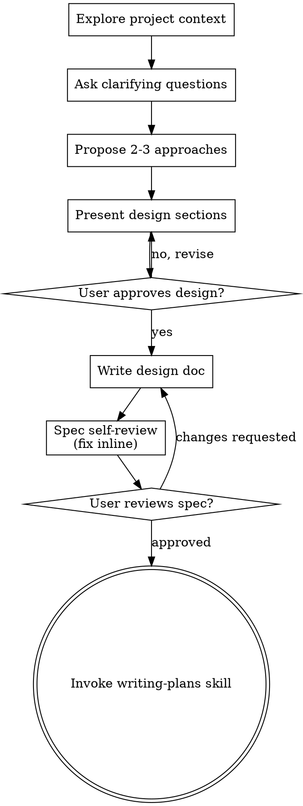

# Brainstorming Ideas Into Designs

Help turn ideas into fully formed designs and specs through natural collaborative dialogue.

Start by understanding the current project context, then ask questions one at a time to refine the idea. Once you understand what you're building, present the design and get user approval.

**The gate:** present a design and get approval before writing code, scaffolding, or invoking
an implementation skill. This is the one firm rule here — the value of the skill is entirely in
the conversation happening *before* the build, and starting to build ends that conversation.

Scale the design to the work, not the other way around. A single-function utility may need
three sentences; a new subsystem needs sections. But "this is too simple to need a design" is
usually wrong for a specific reason — simple-looking asks are where unexamined assumptions
survive longest, because nobody thought to check them.

## Checklist

Work these in order:

1. **Explore project context** — check files, docs, recent commits
2. **Ask clarifying questions** — hypothesis and confidence number first, then one at a time; understand purpose/constraints/success criteria
3. **Propose 2-3 approaches** — with trade-offs and your recommendation
4. **Present design** — in sections scaled to their complexity, get an explicit approval after each section
5. **Write design doc** — save to `docs/specs/YYYY-MM-DD-<topic>-design.md` (leave it uncommitted — the no-auto-commit rule applies here too)
6. **Spec self-review** — quick inline check for placeholders, contradictions, ambiguity, scope (see below)
7. **User reviews written spec** — ask user to review the spec file before proceeding
8. **Transition to implementation** — invoke writing-plans skill to create implementation plan. If the spec implies crypto/auth/date-tz/money/parsing or a new dependency, flag it so the plan's anti-reinvention gate picks it up.

## Process Flow



**The terminal state is invoking writing-plans.** Do NOT invoke frontend-design, mcp-builder, or any other implementation skill. The ONLY skill you invoke after brainstorming is writing-plans.

## The Process

**Before the first question, state your read:**

- Write your current best read of what the user wants in **one sentence**, with an honest
  confidence number next to it. Below ~70%, name what's missing on the same line:

  ```
  HYPOTHESIS: You want to answer "how are we doing?" in standup, and "dashboard" was the
  convention that came to mind.
  CONFIDENCE: ~30% — missing: who it's for, what "metrics" means here, what success looks like
  ```

- The number is there to force honesty, not to be precise. If you wrote a high number but can't
  predict how the user would react to the next three questions you'd ask, the number is wrong —
  start where you can defend it.
- Naming the gaps is what makes the number useful: it tells the user exactly what the
  conversation still has to surface, so they can close it in one message instead of five.
- Restate the read with an updated number as answers land. A number that hasn't moved after
  several questions means you're asking the wrong ones.

**Understanding the idea:**

- Check out the current project state first (files, docs, recent commits)
- Before asking detailed questions, assess scope: if the request describes multiple independent subsystems (e.g., "build a platform with chat, file storage, billing, and analytics"), flag this immediately. Don't spend questions refining details of a project that needs to be decomposed first.
- If the project is too large for a single spec, help the user decompose into sub-projects: what are the independent pieces, how do they relate, what order should they be built? Then brainstorm the first sub-project through the normal design flow. Each sub-project gets its own spec → plan → implementation cycle.
- For appropriately-scoped projects, ask questions one at a time to refine the idea
- Prefer multiple choice questions when possible, but open-ended is fine too
- Only one question per message - if a topic needs more exploration, break it into multiple questions
- Focus on understanding: purpose, constraints, success criteria
- When the idea touches a known domain (auth, data, payments, realtime, search, file upload, LLM/agent, etc.), draw your clarifiers from [`domain-probes.md`](./domain-probes.md) — these are the sharp, expert-level questions that surface design-determining decisions a generic "what are the requirements?" misses. Ask the 2–3 that matter, not the whole list.

**Listening for "want" vs. "should want":**

The riskiest answers are the ones that sound like a thoughtful answer instead of describing what
the user actually wants. The signals:

- Best-practice talk with no specifics — "scalable", "clean architecture", "modern"
- Deference to convention — "the way most apps do it", "the standard approach"
- Hedged obligation — "I should probably…", "I think I'm supposed to…"
- A buzzword standing in for an outcome

When you hear one, the probe that usually unlocks it:

> *"If you didn't have to justify this to anyone, what would you actually want?"*

The pull toward agreement runs the other way too — a user being agreeable will ratify whatever
you put in front of them, which reads as convergence and isn't. Stay visibly willing to be
wrong, and occasionally aim a question in a direction you expect push-back on.

**Knowing when to stop asking:**

Stop when you can answer yes to: *can I predict the user's answer to the next three questions
I'd ask?* If yes, you understand the idea well enough to present a design. If no, ask the next
question. It's a checkable test, which is the point — "we've talked enough" is a feeling and
this isn't.

It has a floor, though. Several rounds without being able to predict is information about the
ask, not a reason to keep grinding: say so and step back — *"I've asked five questions and still
can't predict your answers; something foundational is missing. Should we back up?"* Usually the
ask needs decomposing (see the scope check above) or the underlying goal isn't settled yet.

**Exploring approaches:**

- Propose 2-3 different approaches with trade-offs
- Present options conversationally with your recommendation and reasoning
- Lead with your recommended option and explain why

**Presenting the design:**

- Once you believe you understand what you're building, present the design
- Scale each section to its complexity: a few sentences if straightforward, up to 200-300 words if nuanced
- Before asking for approval on a section, reach for the analytical lenses that fit its TYPE — see [`section-lenses.md`](./section-lenses.md). Apply them in prose (e.g. "Before we lock this risk section, let's pre-mortem it: assume it shipped and failed — most likely cause?"), iterate, then ask for approval. No menu, no checklist — just the 1-2 lenses that fit.
- Ask after each section whether it looks right so far
- Cover: architecture, components, data flow, error handling, testing
- Be ready to go back and clarify if something doesn't make sense

**What doesn't count as approval:**

The gate is an explicit yes to the design as you've stated it. These aren't that:

- **"Whatever you think is best"** — delegation, not a decision. It usually means the user
  isn't confident here either. Re-ask it as a choice between two concrete options.
- **"Sounds good" / "sure, let's go"** — agreement with the shape of the proposal, not with its
  specifics. Follow up: "anything you'd refine?"
- **Silence, or "okay, let's start"** — often the user giving up on the conversation rather than
  converging with you. Ask what you've missed.

Fold any correction back in, restate, and ask again. Loop until the yes is explicit. A yes to a
vague design is the most expensive kind, because everyone then proceeds as though it were agreed.

**Design for isolation and clarity:**

- Break the system into smaller units that each have one clear purpose, communicate through well-defined interfaces, and can be understood and tested independently
- For each unit, you should be able to answer: what does it do, how do you use it, and what does it depend on?
- Can someone understand what a unit does without reading its internals? Can you change the internals without breaking consumers? If not, the boundaries need work.
- Smaller, well-bounded units are also easier for you to work with - you reason better about code you can hold in context at once, and your edits are more reliable when files are focused. When a file grows large, that's often a signal that it's doing too much.

**Working in existing codebases:**

- Explore the current structure before proposing changes. Follow existing patterns.
- Where existing code has problems that affect the work (e.g., a file that's grown too large, unclear boundaries, tangled responsibilities), include targeted improvements as part of the design - the way a good developer improves code they're working in.
- Don't propose unrelated refactoring. Stay focused on what serves the current goal.

## After the Design

**Documentation:**

- Write the validated design (spec) to `docs/specs/YYYY-MM-DD-<topic>-design.md`
  - (User preferences for spec location override this default)
- Use elements-of-style:writing-clearly-and-concisely skill if available
- Leave the design document uncommitted (the no-auto-commit rule applies here too)

**Spec Self-Review:**
After writing the spec document, look at it with fresh eyes:

1. **Placeholder scan:** Any "TBD", "TODO", incomplete sections, or vague requirements? Fix them.
2. **Internal consistency:** Do any sections contradict each other? Does the architecture match the feature descriptions?
3. **Scope check:** Is this focused enough for a single implementation plan, or does it need decomposition?
4. **Ambiguity check:** Could any requirement be interpreted two different ways? If so, pick one and make it explicit.

Fix any issues inline. No need to re-review — just fix and move on.

For a deeper, independent pass on a large or high-stakes spec, dispatch a reviewer subagent using the template in `./spec-document-reviewer-prompt.md`.

**User Review Gate:**
After the spec review loop passes, ask the user to review the written spec before proceeding:

> "Spec written to `<path>` (uncommitted). Please review it and let me know if you want to make any changes before we start writing out the implementation plan."

Wait for the user's response. If they request changes, make them and re-run the spec review loop. Only proceed once the user approves.

**Implementation:**

- Invoke the writing-plans skill to create a detailed implementation plan
- Do NOT invoke any other skill. writing-plans is the next step.

## When talking it out isn't enough — build a throwaway

Some design questions don't resolve in conversation. You can argue about whether a state machine
handles the edge case, or you can run it for thirty seconds and find out. When a question is
about *behavior* rather than *preference*, the prototype is faster than the discussion.

Reach for one when:

- The disagreement is about how something will actually behave, not which option is nicer.
- Nobody can describe the interaction without hand-waving ("it'd feel weird if…").
- The approaches are hard to compare in the abstract because they differ structurally.

Two shapes cover most cases:

- **State and logic questions** → a runnable script or terminal app that exercises the real
  transitions. No UI, no persistence, no error handling. Print the states and step through them.
- **Interaction and layout questions** → several *radically different* variations reachable from
  one entry point, so they can be compared side by side. Variations that differ by a shade of
  padding teach nothing; make them genuinely different bets.

Three rules that keep this from becoming the implementation:

1. **Timebox it and say the number out loud** before starting.
2. **It is throwaway.** Say so explicitly. Prototype code that quietly becomes production code
   is the most expensive outcome here — it arrives untested, unreviewed, and load-bearing.
   (`test-driven-development` exempts throwaway prototypes for exactly this reason; the exemption
   only holds while the code stays throwaway.)
3. **Answer the question, then delete it.** Carry the *finding* into the design, not the code.
   If something in it turns out to be worth keeping, rebuild that part properly.

This is the same instinct as `writing-plans`' spike — carve out the unknown so the rest can be
planned with confidence. A spike resolves an unknown inside a plannable scope; a prototype
answers a design question before there is a plan at all.

## Key Principles

- **One question at a time** - Don't overwhelm with multiple questions
- **Multiple choice preferred** - Easier to answer than open-ended when possible
- **Say your confidence out loud** - A number with the gaps named beats a silent assumption
- **Predict before you present** - Stop asking once you can predict the next three answers
- **Explicit yes only** - "Whatever you think" and "sounds good" aren't approval
- **YAGNI ruthlessly** - Remove unnecessary features from all designs
- **Explore alternatives** - Always propose 2-3 approaches before settling
- **Incremental validation** - Present design, get approval before moving on
- **Be flexible** - Go back and clarify when something doesn't make sense
