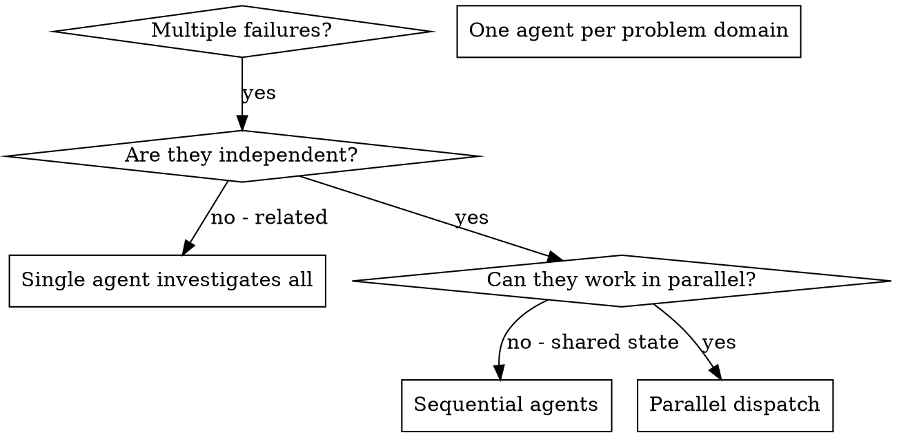

# Dispatching Parallel Agents

## Overview

You delegate tasks to specialized agents with isolated context. By precisely crafting their instructions and context, you ensure they stay focused and succeed at their task. They should never inherit your session's context or history — you construct exactly what they need. This also preserves your own context for coordination work.

When you have multiple unrelated failures (different test files, different subsystems, different bugs), investigating them sequentially wastes time. Each investigation is independent and can happen in parallel.

**Core principle:** Dispatch one agent per independent problem domain. Let them work concurrently.

## Escalation ladder: inline → delegate → orchestrate

Match the machinery to the work. Most tasks don't need agents at all; reach up the ladder only
when the rung below can't carry the job.

| Reach for                                                    | When                                                                                                                                                                                                                                                    | Cost                        |
| ------------------------------------------------------------ | ------------------------------------------------------------------------------------------------------------------------------------------------------------------------------------------------------------------------------------------------------- | --------------------------- |
| **Inline / direct**                                          | a single fact or edit you can already locate                                                                                                                                                                                                            | ~free                       |
| **One subagent**                                             | a bounded search or self-contained task where you want the conclusion, not the file-dumps, and want to keep your own context clean                                                                                                                      | one agent                   |
| **Orchestrated workflow** (deterministic fan-out / pipeline) | the work is genuinely **broad** (sweep many files/sources), needs **confidence** (independent perspectives + adversarial verification before you commit), or **exceeds one context** (migration, audit, large refactor) — **and the user has opted in** | many agents — be deliberate |

A workflow is only as good as its **decomposition** and its **verification stage**. If you can't
say what fans out and what checks it, you're not ready to launch one — scout inline first to
discover the work-list, then orchestrate over it.

## Is a workflow worth the tokens?

Orchestration is leverage, not a default — it can spend many agents' worth of tokens in one go.
Be thoughtful (this is `cost-aware-llm-pipeline`'s discipline applied to orchestration):

- **Opt-in, never inferred.** Launch a multi-agent workflow only when the user asked for that
  scale, a command/skill dispatched it, or they named one. A task that would merely _benefit_ from
  parallelism doesn't qualify — describe the option and the rough cost, and ask.
- **Scale rigor to the ask.** "Find any bugs" → a few finders + single-vote verify. "Exhaustively
  audit" → a larger pool + a 3–5-vote adversarial pass + synthesis. Don't apply max ceremony to a
  quick check.
- **Estimate before you spend.** Budget `agents × (task tokens + per-agent cold start)` —
  each dispatched agent re-pays its own system prompt and tool definitions every turn, so
  real fan-out overhead runs closer to ~4x for even a two-agent split, not the naive 2x
  (`cost-aware-llm-pipeline` has the loop-cost mechanics). If it's large, say so.

## Read-heavy fans out; write-heavy stays serialized (or isolated)

The industry's multi-agent debate settled on an asymmetry, not a winner:

- **Read-heavy work parallelizes beautifully** — research, review, search, parallel
  hypothesis testing. Independent readers can't corrupt shared state, and their findings
  merge cheaply. This is where fan-out earns its tokens.
- **Write-heavy work punishes naive parallelism** — concurrent editors on shared state
  conflict and interfere. Parallel writers need **provable isolation** (disjoint file sets,
  or a worktree/sandbox per agent — the vendor-converged default for parallel coding
  agents) or they run sequentially. One writer at a time isn't a limitation; it's the cheap
  correctness guarantee.
- **Entangled reasoning doesn't decompose.** At a fixed total token budget, one agent beats
  a committee on tightly-coupled reasoning — coordination overhead eats the budget the
  reasoning needed. Fan out for breadth and wall-clock, never expecting the split itself to
  add intelligence.

Peers reporting to a coordinator beat peers chatting freely: the orchestrator-mediated
shape — you carry the baton; workers return **compressed results (a ~1–2k-token summary,
not a transcript)** — is the converged production pattern. Where the dispatch primitive
supports schema-constrained returns, use them: parsing prose out of a worker's reply is a
failure mode you can simply delete.

## When to Use

**Use when:**

- 3+ test files failing with different root causes
- Multiple subsystems broken independently
- Each problem can be understood without context from others
- No shared state between investigations

**Don't use when:**

- Failures are related (fix one might fix others)
- Need to understand full system state
- Agents would interfere with each other

## When NOT to Use

**Related failures:** Fixing one might fix others - investigate together first
**Need full context:** Understanding requires seeing entire system
**Exploratory debugging:** You don't know what's broken yet
**Shared state:** Agents would interfere (editing same files, using same resources)

## Going deeper

- [`patterns.md`](patterns.md) — the dispatch pattern, context-packet structure, a worked
  example, and how to verify what came back. Read before your first dispatch of a run.
- [`harness-notes.md`](harness-notes.md) — what each harness gives you and the graceful
  degradation path when a primitive is missing.
