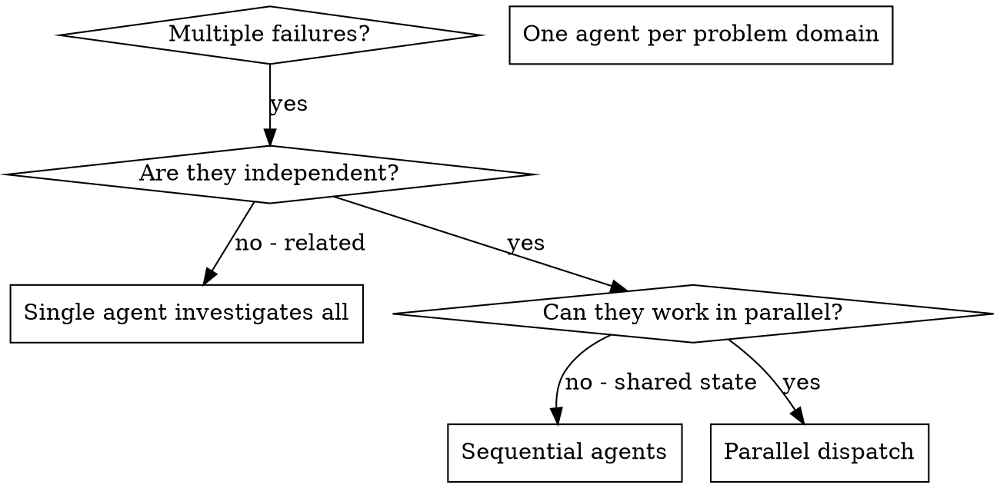

# Dispatching Parallel Agents

## Overview

You delegate tasks to specialized agents with isolated context. By precisely crafting their instructions and context, you ensure they stay focused and succeed at their task. They should never inherit your session's context or history — you construct exactly what they need. This also preserves your own context for coordination work.

When you have multiple unrelated failures (different test files, different subsystems, different bugs), investigating them sequentially wastes time. Each investigation is independent and can happen in parallel.

**Core principle:** Dispatch one agent per independent problem domain. Let them work concurrently.

## Escalation ladder: inline → delegate → orchestrate

Match the machinery to the work. Most tasks don't need agents at all; reach up the ladder only
when the rung below can't carry the job.

| Reach for                                                    | When                                                                                                                                                                                                                                                    | Cost                        |
| ------------------------------------------------------------ | ------------------------------------------------------------------------------------------------------------------------------------------------------------------------------------------------------------------------------------------------------- | --------------------------- |
| **Inline / direct**                                          | a single fact or edit you can already locate                                                                                                                                                                                                            | ~free                       |
| **One subagent**                                             | a bounded search or self-contained task where you want the conclusion, not the file-dumps, and want to keep your own context clean                                                                                                                      | one agent                   |
| **Orchestrated workflow** (deterministic fan-out / pipeline) | the work is genuinely **broad** (sweep many files/sources), needs **confidence** (independent perspectives + adversarial verification before you commit), or **exceeds one context** (migration, audit, large refactor) — **and the user has opted in** | many agents — be deliberate |

A workflow is only as good as its **decomposition** and its **verification stage**. If you can't
say what fans out and what checks it, you're not ready to launch one — scout inline first to
discover the work-list, then orchestrate over it.

## Is a workflow worth the tokens?

Orchestration is leverage, not a default — it can spend many agents' worth of tokens in one go.
Be thoughtful (this is `cost-aware-llm-pipeline`'s discipline applied to orchestration):

- **Opt-in, never inferred.** Launch a multi-agent workflow only when the user asked for that
  scale, a command/skill dispatched it, or they named one. A task that would merely _benefit_ from
  parallelism doesn't qualify — describe the option and the rough cost, and ask.
- **Scale rigor to the ask.** "Find any bugs" → a few finders + single-vote verify. "Exhaustively
  audit" → a larger pool + a 3–5-vote adversarial pass + synthesis. Don't apply max ceremony to a
  quick check.
- **Estimate before you spend.** Roughly `agents × tokens-each`; if it's large, say so.

## Harness-neutral: orchestrate with whatever the harness gives you

The ladder is universal; the _mechanism_ is harness-specific. keystone runs on more than one
harness — name tools as instances, degrade gracefully:

- **If the harness has a deterministic orchestration primitive** (e.g. Claude Code's Workflow
  tool, or another agent/exec runner) — use it for fan-out/pipeline work, and prefer **pipeline by
  default**: a barrier (wait-for-all) is only right when a stage genuinely needs every prior
  result (dedup across the full set, early-exit on zero). Otherwise items flow independently.
- **If it only has plain subagent dispatch** (e.g. Claude Code's Task tool) — fan out manually as
  below; you carry the baton between stages.
- **If it has neither** — decompose and run sequentially yourself. The structure (find → verify →
  synthesize) still applies; you just hold it in one context.

Quality patterns that travel across harnesses: **adversarial verify** (independent skeptics per
finding, kill on majority-refute), **loop-until-dry** (keep finding until K rounds surface nothing
new), **completeness critic** (a final "what's missing?" pass). Don't silently cap coverage —
say what you dropped.

## When to Use



**Use when:**

- 3+ test files failing with different root causes
- Multiple subsystems broken independently
- Each problem can be understood without context from others
- No shared state between investigations

**Don't use when:**

- Failures are related (fix one might fix others)
- Need to understand full system state
- Agents would interfere with each other

## The Pattern

### 1. Identify Independent Domains

Group failures by what's broken:

- File A tests: Tool approval flow
- File B tests: Batch completion behavior
- File C tests: Abort functionality

Each domain is independent - fixing tool approval doesn't affect abort tests.

### 2. Create Focused Agent Tasks

Each agent gets:

- **Specific scope:** One test file or subsystem
- **Clear goal:** Make these tests pass
- **Constraints:** Don't change other code
- **Expected output:** Summary of what you found and fixed

### 3. Dispatch in Parallel

Fan the domains out through **whatever parallel-dispatch primitive your harness gives you** — one
_instance_ of the mechanism, not a fixed API: Claude Code's Task tool, a workflow runner's
fan-out step, another agent/exec runner. The pattern is the constant: one agent per independent
domain, all launched before you wait on any.

```
dispatch → "Fix agent-tool-abort.test.ts failures"
dispatch → "Fix batch-completion-behavior.test.ts failures"
dispatch → "Fix tool-approval-race-conditions.test.ts failures"
# all three run concurrently
```

Degrade gracefully by what the harness offers:

- **A real fan-out primitive** (workflow runner, batch dispatch) → issue all three in one batch so
  they run at once.
- **Only plain subagent dispatch** (e.g. Claude Code's Task tool) → launch them the same way; you
  carry the baton between stages.
- **Neither** → run the three sequentially in your own context. The decomposition and the
  verification step still hold — you just forgo the wall-clock win.

### 4. Review and Integrate

When agents return:

- Read each summary
- Verify fixes don't conflict
- Run full test suite
- Integrate all changes

## Agent Prompt Structure

Good agent prompts are:

1. **Focused** - One clear problem domain
2. **Self-contained** - All context needed to understand the problem
3. **Specific about output** - What should the agent return?

```markdown
Fix the 3 failing tests in src/agents/agent-tool-abort.test.ts:

1. "should abort tool with partial output capture" - expects 'interrupted at' in message
2. "should handle mixed completed and aborted tools" - fast tool aborted instead of completed
3. "should properly track pendingToolCount" - expects 3 results but gets 0

These are timing/race condition issues. Your task:

1. Read the test file and understand what each test verifies
2. Identify root cause - timing issues or actual bugs?
3. Fix by:
   - Replacing arbitrary timeouts with event-based waiting
   - Fixing bugs in abort implementation if found
   - Adjusting test expectations if testing changed behavior

Do NOT just increase timeouts - find the real issue.

Return: Summary of what you found and what you fixed.
```

## Common Mistakes

**❌ Too broad:** "Fix all the tests" - agent gets lost
**✅ Specific:** "Fix agent-tool-abort.test.ts" - focused scope

**❌ No context:** "Fix the race condition" - agent doesn't know where
**✅ Context:** Paste the error messages and test names

**❌ No constraints:** Agent might refactor everything
**✅ Constraints:** "Do NOT change production code" or "Fix tests only"

**❌ Vague output:** "Fix it" - you don't know what changed
**✅ Specific:** "Return summary of root cause and changes"

## When NOT to Use

**Related failures:** Fixing one might fix others - investigate together first
**Need full context:** Understanding requires seeing entire system
**Exploratory debugging:** You don't know what's broken yet
**Shared state:** Agents would interfere (editing same files, using same resources)

## Real Example from Session

**Scenario:** 6 test failures across 3 files after major refactoring

**Failures:**

- agent-tool-abort.test.ts: 3 failures (timing issues)
- batch-completion-behavior.test.ts: 2 failures (tools not executing)
- tool-approval-race-conditions.test.ts: 1 failure (execution count = 0)

**Decision:** Independent domains - abort logic separate from batch completion separate from race conditions

**Dispatch:**

```
Agent 1 → Fix agent-tool-abort.test.ts
Agent 2 → Fix batch-completion-behavior.test.ts
Agent 3 → Fix tool-approval-race-conditions.test.ts
```

**Results:**

- Agent 1: Replaced timeouts with event-based waiting
- Agent 2: Fixed event structure bug (threadId in wrong place)
- Agent 3: Added wait for async tool execution to complete

**Integration:** All fixes independent, no conflicts, full suite green

**Time saved:** 3 problems solved in parallel vs sequentially

## Key Benefits

1. **Parallelization** - Multiple investigations happen simultaneously
2. **Focus** - Each agent has narrow scope, less context to track
3. **Independence** - Agents don't interfere with each other
4. **Speed** - 3 problems solved in time of 1

## Verification

After agents return:

1. **Review each summary** - Understand what changed
2. **Check for conflicts** - Did agents edit same code?
3. **Run full suite** - Verify all fixes work together
4. **Spot check** - Agents can make systematic errors

## Real-World Impact

From debugging session (2025-10-03):

- 6 failures across 3 files
- 3 agents dispatched in parallel
- All investigations completed concurrently
- All fixes integrated successfully
- Zero conflicts between agent changes
