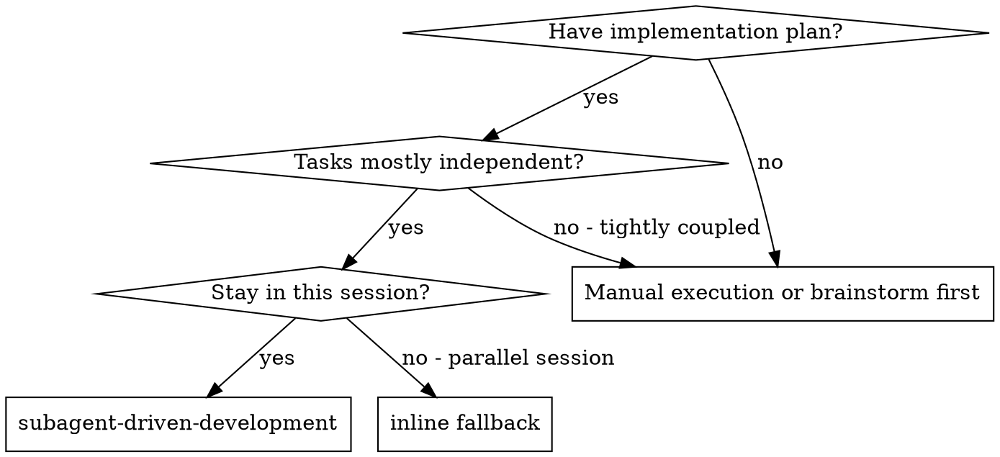
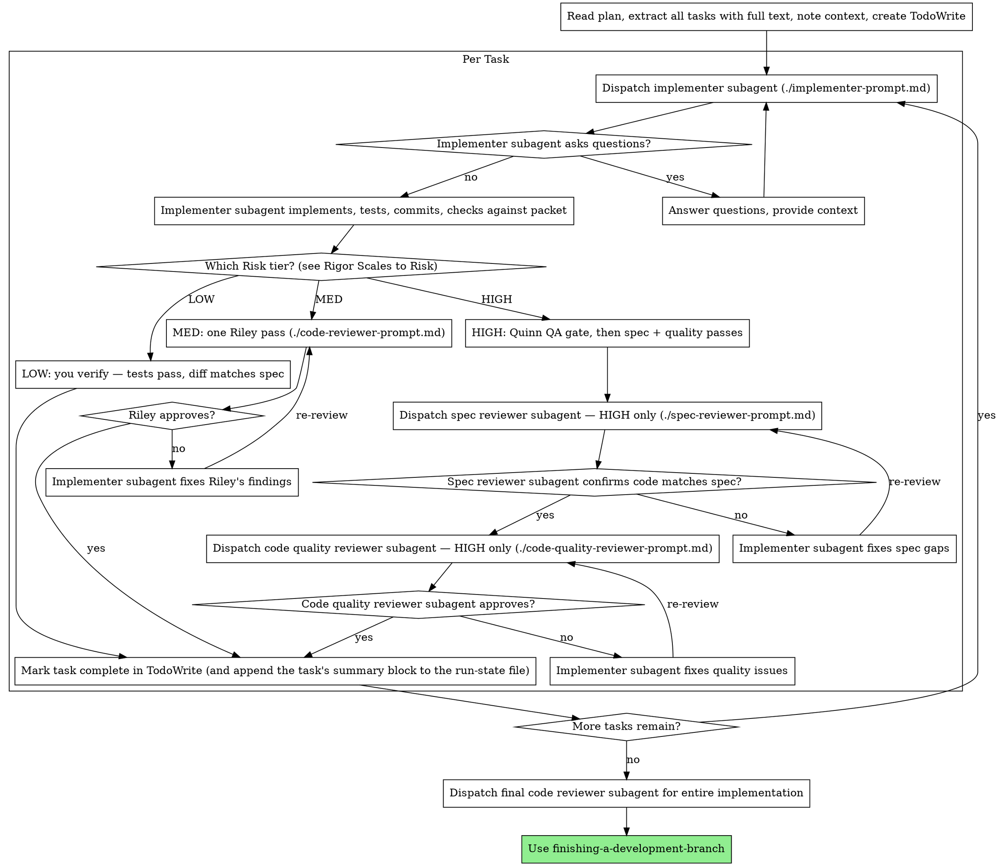

# Subagent-Driven Development

Execute a plan by dispatching a fresh subagent per **slice** of it, with review after each task at that task's risk tier.

**Core principle:** Fresh context per **slice** of the plan + review gated to each task's risk = high quality, fast iteration

For how to construct a dispatch — what goes in a self-contained context packet, when delegation
beats working inline, and the cross-harness fallbacks — see the `dispatching-parallel-agents`
skill. This skill covers the execution loop that sits on top of it.

**Continuous execution:** Don't stop between tasks to ask whether to keep going. The user asked
you to execute the plan; execute it. Stop only for a BLOCKED status you can't resolve, ambiguity
that genuinely prevents progress, or completion. Interim "should I continue?" prompts and
progress summaries cost the user a turn and tell them nothing they didn't already expect.
Before you end any turn mid-run, read your own last paragraph: if it is a plan, a question the
plan already answers, or a "Next, I'll dispatch…", that is work to do now, not a message to
send. End the turn only at completion or on a blocker only the user can clear.

## Why fresh context — context rot

Fresh context isn't a style choice; it's the defense against **context rot**. As a
window fills, a model doesn't fail loudly — its quality quietly degrades: it contradicts
decisions made earlier in the session, drifts from the codebase's style, ignores requirements
now buried deep in the history, and starts inventing file or function names that don't exist.
The longer a single context runs, the worse it silently gets. So work goes to a subagent
that starts clean, receives exactly its packet, and terminates — its rot dies with it.

**Dispatch a slice, not necessarily a single task.** Rot is real; the threshold is not one task.
A **slice** is consecutive plan tasks that share files or an interface, sized so the packet plus
the files it touches fit comfortably in one worker window. Defaults:

- A plan of **≤3 tasks is one slice** — splitting it costs more coordination than the rot it avoids.
- Tasks that are **genuinely disjoint** (no shared files, no shared interface) may go one per
  dispatch — which is also what makes them wave-able (`./parallel-waves.md`).
- A slice's **Risk is the max of its tasks'**, and gates run **per task** at each task's own
  tier. Slicing changes what gets *dispatched*, never what gets *reviewed*.
- **Split on signal:** a worker returning `NEEDS_CONTEXT` for want of window, or a report that
  thins out across the later tasks, means the slice was too big. Split and re-dispatch.

Why not always one-per-task: each dispatch re-pays its own cold start (system prompt + tool
definitions — ~4x overhead for even a two-way split; `dispatching-parallel-agents` has the
mechanics), and a coherent multi-file change is exactly the work that suffers most from being
cut into fragments that each rediscover the same context. **Tasks remain the tracking unit** —
run-state checkboxes, the resume heuristic, and AC tracing are all per task, and a slice's
worker returns per-task evidence.
(Rot is one of three independent reasons this pattern wins: shared-context orchestration also
measurably loses steering accuracy as unrelated agent traffic accumulates, and per-task
isolation is what keeps each dispatch's cost linear instead of compounding.)

This protects the **subagents**. Protect your **own** orchestrator window too:

- **Clear at the plan→implement boundary.** Once the plan is written and saved, the plan file
  is the source of truth — you don't need the planning conversation. Clearing there starts
  execution on a clean window.
- **Compact at logical boundaries, not mid-task.** Prefer manual compaction between tasks over
  auto-compaction that can fire mid-thought. A finished task is a safe compaction point; a
  half-built one is not.
- **Don't absorb subagent verbosity.** Carry forward the result (status, files, findings), not
  the subagent's full narrative — that's their rot, kept out of your window.

## Run-state (resumable execution)

Make "don't absorb verbosity" concrete: write each task's trimmed result to a **run-state
file** on disk and keep only a one-line stub per finished task in your window. The file — not
your context — is the source of truth, so a compaction or crash can't lose the run, and a
`/pickup` can pick it back up.

- **At run start,** create the run-state file from `./run-state-format.md` (`RUN-STATE.md` in a
  folder plan, or `<plan>.run-state.md` beside a single-file plan). One file per run.
- **After each task completes,** append its compact summary block (status / files / the one
  durable finding / any concern) and tick its checkbox. Carry only a one-line stub forward.
- **The moment you make an orchestrator-override call,** record it as a Locked decision in the
  file, so a resumed run inherits the decision instead of relitigating it.

**You carry the baton** — only the orchestrator writes the run-state (the implementer writes
nothing to it). It's **optional for short runs**: a 2-task plan doesn't need it. Rigor scales to
run length, the same as everything else here.

**At Heavy level,** also create a **run-manifest** from `keystone/templates/plans/run-manifest.md`
and keep per-task summary spillover. The manifest is a sibling index pointing at the run's
artifacts (run-state, research, codebase map, ADRs, handoffs). This is the
**additive-and-ignorable invariant**: a resume reads only the run-state task log — the manifest,
research, and summaries are enrichment a resume may use but never needs.

To pick a run back up (via `/pickup`), the resume point is fixed by one rule, stated verbatim in
`./run-state-format.md`:
**The first task that is unchecked, or checked with no summary block, is where to resume.**

On resume, the plan header's `Level:` is **advisory context only** — a resumed run may read it to
pick which scaffolding to keep, but a **missing or unreadable `Level:` defaults to Medium and
never blocks the resume**. `/pickup` still keys solely off the run-state task log.

## The crew

You are the **orchestrator**. You don't implement or review yourself — you dispatch named
crew members (registered agents) and route their results. Subagents can't talk to each other;
**you carry the baton** between them.

| Member    | Agent type          | Does                                      | Edits code?          |
| --------- | ------------------- | ----------------------------------------- | -------------------- |
| **Pat**   | `planner`           | turns a spec into the plan/handoff packet | no                   |
| **Mason** | `implementer`       | builds one task, TDD                      | **yes — only Mason** |
| **Quinn** | `qa`                | risk/coverage/trace/NFR → graded gate     | no                   |
| **Riley** | `code-reviewer`     | production-readiness review               | no                   |
| **Sage**  | `security-reviewer` | security audit (when there's a surface)   | no                   |

**The handoff packet** — what you hand each member is a self-contained context block so they
never have to go hunting (this is the single biggest quality lever): **acceptance criteria**,
**files to touch**, **dev notes** (patterns/utilities to reuse), the **verified-behavior** of
load-bearing touchpoints (with `[Source: file:line]` citations from the plan), the **testing
standard**, **references**, and the **matching repo lessons**. For that last slot: at run
start, read this repo's banked lessons once (`node "$CLAUDE_PLUGIN_ROOT/hooks/learnings.js"
--path` prints the file; harness-neutral fallback: `~/.claude/keystone/learnings/<repo-slug>.md`)
and give each packet only the few entries whose subject or `**Triggers:**` line matches that
task's files/domain. This is how banked lessons actually reach the crew — session-start
surfacing does not follow a dispatch, so a packet without them re-pays for known mistakes.
Build it from the plan; pass it in the dispatch prompt, not as
"go read the plan file." The packet is a **hard ceiling, not a starting point** — a subagent
that has to read the plan file or wander the tree to orient is a packet you under-built. If it's
missing a fact, fix the packet, don't tell the subagent to go find it. Every packet ends with
the standard footer from `dispatching-parallel-agents/patterns.md` — the worker runs
unattended, batches its independent calls, stays inside the packet, and returns a result, not
a transcript. The implementer and reviewer templates below carry it; for any other dispatch
(Quinn, Sage, a one-off), append it yourself.

**The chain:** Pat (plan) → **Mason** (implement) → **Riley** (review; at HIGH, **Quinn**'s QA
gate runs first) → **Sage** (security, if a sensitive surface is in scope). Read the Risk table
below for which gates actually fire. Quinn and Riley are **advisory** — they return a graded
verdict (PASS / CONCERNS / FAIL; **WAIVED is yours**, not theirs — a gate reports, only you
accept a known issue); **you** own the ship decision:

- **FAIL** → back to Mason with the verbatim findings (bounded by Review Loop Control below).
- **CONCERNS** → you decide: accept-and-proceed (record them as `/learn` candidates) or loop.
- **PASS / WAIVED** → advance to the next member or next task.

## When to Use

**vs. Executing Plans (parallel session):**

- Same session (no context switch)
- Fresh subagent per slice (no context pollution)
- Review after each task at its Risk tier — one pass at MED, spec-then-quality at HIGH
- Faster iteration (no human-in-loop between tasks)

## The Process

## Model Selection

Use the cheapest **model-and-effort pairing** that can handle each role. Effort is the finer
dial: a frontier model at low effort is often cheaper _and_ stronger than a smaller model at
high effort, so "cheap" below means the cheapest pairing your evals show clearing the bar, not
necessarily the smallest model. Two cautions carry over from `designing-agent-systems`: on some
models low effort suppresses search, so a scouting or research seat gets a rung up; and effort
names don't mean the same thinking budget across models, so re-sweep on migration.

**Mechanical implementation tasks** (isolated functions, clear specs, 1-2 files): use a fast, cheap model. Most implementation tasks are mechanical when the plan is well-specified.

**Integration and judgment tasks** (multi-file coordination, pattern matching, debugging): use a standard model.

**Architecture, design, and review tasks**: use the most capable available model.

**Task complexity signals:**

- Touches 1-2 files with a complete spec → cheap model
- Touches multiple files with integration concerns → standard model
- Requires design judgment or broad codebase understanding → most capable model

**Declare the tier on the dispatch, where the harness supports it.** If the dispatch primitive
takes a per-dispatch model or reasoning-effort override (e.g. Claude Code's Agent tool), set it
explicitly from the Risk table below rather than leaving tier choice implicit in prompt wording;
on a harness without overrides, this section stays advisory prose. Keystone deliberately does
**not** pin a model in the agent definitions — the same reviewer sees trivial and critical diffs,
so tier is a per-task call, not a per-agent one. The tier ladder — and how to resolve current model
IDs and prices at build time (never hardcoded in prose or code) — lives in
`designing-agent-systems`, including the top adjudication tier above the everyday ladder.

## Rigor Scales to Risk

Model Selection scales _which model_ runs each task; this scales _which gates_ run. Match
ceremony to blast-radius — the full Quinn-plus-two-Riley-passes sequence earns its cost on
load-bearing tasks and wastes it on mechanical ports. Read the **`Risk` tag** the plan assigns each task (writing-plans
defines the rubric; one HIGH **signal** ⇒ HIGH; an **unanswerable** signal ⇒ HIGH; a **missing
tag** ⇒ score it, per the rule at the end of this section) and run the matching gates:

The run's declared **effort level** (`writing-plans/plan-levels.md`) sets the _default_ tier for
the run; an individual task's **`Risk` tag** can still escalate _its own_ gates above that default
(ceiling, not average, wins per task). The two compose — the level is the floor, the tag is the
per-task ceiling — they don't conflict.

| Risk     | Model        | Gates                                                                       |
| -------- | ------------ | --------------------------------------------------------------------------- |
| **LOW**  | cheap        | Mason → **you verify** (tests pass, diff matches spec). No Riley.           |
| **MED**  | standard     | Mason → Riley, **one pass** (spec + quality + test quality + the AC trace)  |
| **HIGH** | most capable | Mason → Quinn → Riley **spec then quality** → Sage if safety surface        |

**Why MED is one seat.** A second reviewer on the same diff costs a dispatch for marginal
findings we have **no measurement of** — this is the stacked-verification shape
`designing-agent-systems` names as over-delegation, and the `Gates:` tally added alongside this change is
precisely how we intend to find out whether the seat was earning its cost. Until it says
otherwise, spend the seat where blast radius justifies it. So at MED, Riley's single pass takes
over Quinn's
mechanical work — she runs the suite, reads Mason's RED→GREEN evidence, audits test *quality*,
and emits the **one-row-per-AC trace**.

**Be honest about what MED gives up.** This is a trade, not a free merge. Reserved for HIGH,
where Quinn has her own seat: an **independent** risk profile (probability × impact, with
scrutiny budgeted to the riskiest areas rather than a fixed priority order), the **NFR pass**,
and a second reader whose blind spots differ from the first's. Two of Quinn's habits are
**carried into the MED pass** rather than dropped, because they're cheap and load-bearing:

- **Escalate to HIGH, don't just report, when the diff removes or weakens a test, a validation,
  or an authz check** — the same signal Quinn escalates on. This is the trigger that catches an
  over-applied `defend:` tag, so it does not get to live only at HIGH.
- **Tag every number with its provenance** — `measured-now` (you ran it this pass),
  `read-from-artifact`, or `estimated`; write `not measured` where you have none, and call a
  statically-derived concern **potential impact**, not impact. This matters more at MED, not
  less, because Riley now owns the suite run and nobody is double-checking her figures.
- **Severity mapping is Quinn's, unchanged:** an uncovered high-risk AC ⇒ **FAIL**; a missing
  trace row ⇒ FAIL-grade; an uncovered low-risk AC ⇒ CONCERNS.
- **A serious security finding routes to Sage** even though the MED tier doesn't include him —
  escalate the task to HIGH and dispatch him. A security finding is never a nit you file.

**Optional enforcement (where the harness has a pre-edit hook — e.g. Claude Code):** when you
dispatch a MED/HIGH task, you can export `KEYSTONE_TASK_RISK=med|high` and
`KEYSTONE_TASK_FACTS="<the task's verified-behavior>"` so the edit hook hard-blocks an edit that
declares risk without facts. This is belt-and-suspenders teeth on top of the prose gate, not a
replacement — on a harness without such a hook the rubric above still governs, advisorily. Set
`KEYSTONE_FACT_FORCE=off` to mute it.

LOW is for leaf/mechanical/loud-fail tasks only (a guard test, a dead-code sweep) — when in
doubt it's not LOW. If a task tagged LOW turns out to touch a shared contract or fail silently,
stop and treat it as HIGH; the tag was wrong.

**A missing `Risk` tag is a plan defect — score it now, don't default it.** Score it against
`writing-plans`' rubric before dispatching, from the plan **and a read of the files the task
names**: that rubric makes the signals checkable *from the diff/codebase*, not from the plan's
prose. This matters most in exactly the case the rule governs — an untagged task normally has
**no `Verified-behavior` block** (that block is only required once a tag exists, and a Light plan
carries none at all), so the plan text alone rarely settles the safety-surface signals.

**The absence of an alarming word in a plan is not the absence of a signal.** Never score MED on
silence. If the task names no files, or you have not read the ones it names, the signals are
unanswerable ⇒ **HIGH**. Then: any HIGH signal ⇒ **HIGH**; unanswerable ⇒ **HIGH** (an
un-discovered task is un-scorable, which is itself a high-risk signal); otherwise **MED**.
**Never LOW by default** — LOW has to be earned against all four of its signals. Write the tag
you scored into the plan and record it as a **Locked decision** in the run-state. The rule being
enforced is that *nothing runs un-scored* — the cheap way to satisfy it is to read the files, not
to skim the prose.

**Level delta (mid-run).** When a task's real risk exceeds its tag enough to imply a higher run
level (e.g. a Light run hits a safety surface), **stop** per the escalation rule just above,
reconfirm the level with the user before continuing, and record the re-level as a **Locked
decision** in the run-state. This is the run-time twin of writing-plans' finalization delta check;
re-leveling up is monotonic — never silently downgrade.

**Light→Medium materialization (explicit):** a Light run has **no run-state file**. On a re-level
UP from Light, the orchestrator must **create the run-state file now** — back-filling
already-completed tasks as checked-with-summary from what it still holds — before continuing.
Otherwise the partially-done Light work is unresumable. Deepening materializes the artifact; it
never retroactively loses completed work.

Two things this does **not** change: **`DONE_WITH_CONCERNS` stays first-class** (a flagged
robustness hole is signal, run it down regardless of tier), and **you still own the ship
decision** at every tier — the gates are advisory, the tag only sets which ones run.

**Batching (optional, lower-priority):** when the plan marks two tasks independent and they
touch the same file, you _may_ review them as one diff to cut round-trips. It's a tradeoff
(less per-task feedback), not a default — only do it when independence is explicit in the plan.

**Parallel waves (optional):** on large plans you _may_ run independent, isolated tasks in
concurrent **waves** (see `./parallel-waves.md`) to cut wall-clock. The **default stays
sequential**; gates still run per task at their Risk tier (waves skip nothing). Parallel is
allowed **ONLY** when tasks are both **independent** AND **isolated** — disjoint file sets, or
each task in its own worktree. If isolation can't be proven, run sequentially. Within a wave
you keep working — where dispatch returns immediately, gates run per task as each result lands
and only the _next_ wave's dispatch waits on the barrier. On a blocking primitive the wave lands
as one batch; gate them in order.

## Handling deviations (auto-fix vs ask vs defer)

Plans meet reality. When a task hits something the plan didn't anticipate, don't silently expand
scope and don't stop dead — triage with one question: **does this affect correctness, security,
or the ability to finish the task?**

- **Yes → fix it now.** Real bugs, missing validation on something being touched, blockers that
  stop the task. Fix, verify, note it in the report.
- **Judgment call → ask.** Anything with blast radius beyond the task: a new table or migration,
  adding or swapping a dependency, changing a shared interface, expanding scope. Surface the
  choice rather than deciding unilaterally.
- **No → note and defer.** Tangential improvements, "while I'm here" refactors, unrelated debt.
  Record them (a `/learn` candidate or a `keystone:` marker) and move on. One carve-out: a
  **boy-scout cleanup** inside lines the task already edits — a misleading name, a magic number,
  code the diff orphaned — is part of doing the task well. `coding-standards` has the
  three-part boundary.

Most deviations are a fix or a deferral; only the genuinely consequential ones should interrupt.

## Don't offload what you can do yourself

Before asking the user to run a command, edit a file, or fetch a value, check whether you can do
it with the tools you have. "Stop and ask" is for genuine blockers and judgment calls — missing
context, ambiguous intent, consequential decisions — not for handing back automatable mechanics.
Asking someone to be your terminal is friction, not diligence.

The exception is a step that genuinely requires them — an interactive login, a secret you don't
hold, a physical or account action. Name those explicitly when you hit them.

## Harvest the lesson (the loop's automatic capture point)

Task completion is where lessons get captured without anyone remembering to run a command —
the learning loop stands or falls here. **Fatigue guard: offer capture only when a gate
caught something** — Quinn/Riley/Sage returned FAIL (or CONCERNS you acted on), a ⚠️ turned
out to be a real gap, a BLOCKED exposed a wrong plan assumption, or reality contradicted the
packet's verified-behavior. On a clean pass, offer nothing: a reflexive prompt trains a
reflexive "no."

Offer it at a boundary where you'd be stopping anyway — task completion that ends the run, or a
blocker you're already surfacing — never as a mid-run interruption that ends a turn on a question.
(The complementary capture is the gate tally at run end: `finishing-a-development-branch` Step 7
turns "this gate ran N times and caught nothing" into a lesson too. Lessons record what the
gates *found*; the tally records what they *cost*.)

When there is signal, draft the entry in `/learn`'s format — type, 1–3 lines, **evidence =
the finding itself**, `**Triggers:**` tags from the controlled vocabulary — and offer it
one-tap. The human approves; never silently write. Then append the durable finding to the
run-state block as usual (the run-state records what happened this run; the lesson is what
must survive into the next one).

## Review Loop Control

The reviewer → fix → re-review cycle must be bounded, or it can ping-pong forever (or, worse, converge on the reviewer and implementer agreeing while the real issue persists).

- **Pass feedback verbatim.** When you re-dispatch the implementer to fix issues, hand it the reviewer's findings **word-for-word**. Don't paraphrase or summarize — your compression is where requirements get lost. Quote the reviewer.
- **Fixes carry the re-run contract.** A review-driven fix isn't done when the edit lands — it's done when the tests covering it are green _on the code as it now stands_. When you loop a task back to Mason, name the covering tests in the handback (so Mason re-runs those, not the whole suite) and require the fresh result in the return: RED→GREEN for a test-first fix, or the covering tests green after the change. **Never mark a task complete on test evidence from before the fix** — a green run from the prior round is stale.
- **Keep re-reviews adversarial, not confirmatory.** "Is it fixed now?" invites agreement —
  same-model reviewer/implementer pairs drift toward mutual approval across rounds (the
  convergence failure above). Frame every re-review as "find what's still wrong." For
  HIGH-risk tasks, where the harness takes per-dispatch overrides, put the reviewer on a
  different tier — or model family — than the implementer to decorrelate their blind spots.
- **Cap iterations.** Give a review→fix loop ~3 rounds. If it isn't resolved by then, stop looping and escalate to the human — more rounds rarely converge.
- **Detect stalls.** Track the open **must-fix** count — blockers, plus the should-fixes you chose to accept — across rounds; nits don't count toward it, or ordinary nit churn reads as a stall. If it isn't _decreasing_ (same count, or new issues replacing fixed ones each round), the loop is stuck — stop and escalate rather than spinning. A reviewer that keeps finding new issues on each pass is a signal the task or plan is wrong, not that one more round will do it.
- **Verify until closure (bounded).** The same loop governs the QA gate, not just code review. A **FAIL** from Quinn (or a **CONCERNS** the orchestrator decides not to accept) doesn't end at a one-shot handback: loop it back to Mason with Quinn's findings **verbatim**, then **re-verify** — repeat until the gate returns **PASS or WAIVED**. Bound it with the **same ~3-round cap and stall detection** above (don't invent a new limit): if the open-issue count isn't decreasing, escalate to the human instead of spinning. Quinn stays **advisory** — this only makes "iterate until the gap actually closes" explicit; it does **not** turn the gate into a hard blocker. The orchestrator still owns the ship decision and may accept CONCERNS or WAIVE with a stated reason.

## Prompt Templates

Dispatch each with the matching crew member's **agent type** (so its persona + method apply),
passing the template as the task prompt plus the handoff packet:

- `./implementer-prompt.md` — dispatch **Mason** (`implementer`).
- **At MED:** `./code-reviewer-prompt.md` — one **Riley** (`code-reviewer`) pass, carrying the
  AC trace and the evidence check.
- **At HIGH:** the **Quinn** (`qa`) gate first — she runs the tests and returns the graded
  verdict (no separate prompt file; her agent definition is the method) — then
  `./spec-reviewer-prompt.md` and `./code-quality-reviewer-prompt.md` as two **Riley** passes.
  (Sage / `security-reviewer` joins when there's a security surface.)

## Going deeper

- [`worked-example.md`](worked-example.md) — a full run end to end, why the pattern wins, and
  the red flags that mean you have drifted out of it.
- [`no-subagent-fallback.md`](no-subagent-fallback.md) — the same loop collapsed into one
  window, for harnesses without subagent dispatch.
- [`routing-results.md`](routing-results.md) — what to do with each implementer status
  (DONE / DONE_WITH_CONCERNS / NEEDS_CONTEXT / BLOCKED, including the destructive-action stop)
  and how to resolve a reviewer's ⚠️ "cannot verify from diff" items. Read when a dispatch
  returns something other than a clean DONE.

## Integration

**Required workflow skills:**

- **using-git-worktrees** - Ensures isolated workspace (creates one or verifies existing)
- **writing-plans** - Creates the plan this skill executes
- **`./code-reviewer-prompt.md`** - Reviewer dispatch template (also used by `/review`)
- **finishing-a-development-branch** - Complete development after all tasks

**Subagents should use:**

- **test-driven-development** - Subagents follow TDD for each task

**Alternative workflow:**

- **`./no-subagent-fallback.md`** - Use for parallel session instead of same-session execution
