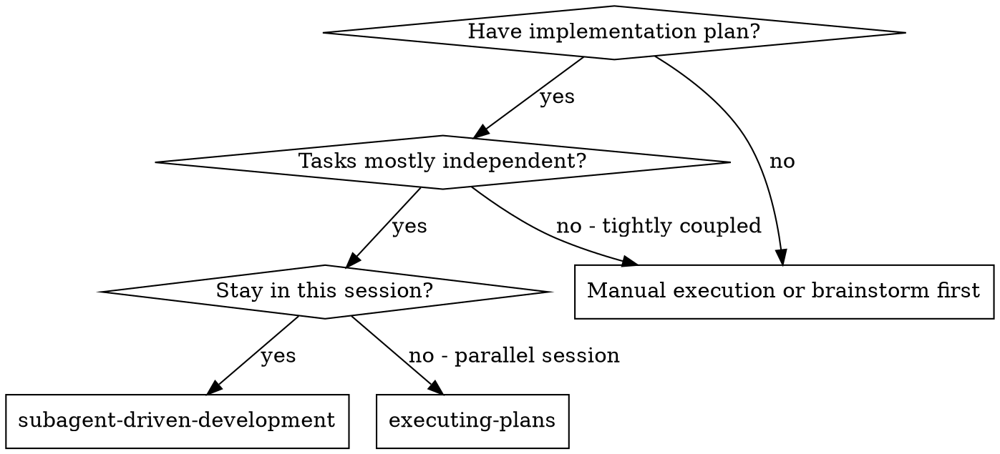
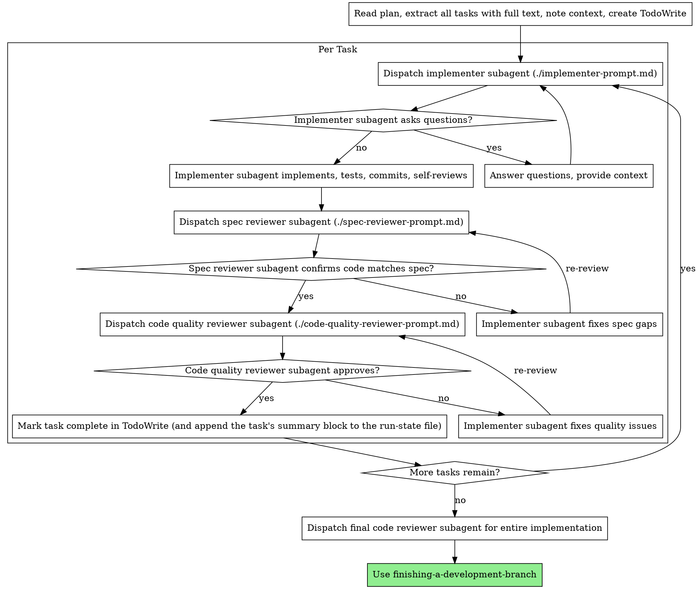

# Subagent-Driven Development

Execute plan by dispatching fresh subagent per task, with two-stage review after each: spec compliance review first, then code quality review.

**Why subagents:** You delegate tasks to specialized agents with isolated context. By precisely crafting their instructions and context, you ensure they stay focused and succeed at their task. They should never inherit your session's context or history — you construct exactly what they need. This also preserves your own context for coordination work.

**Core principle:** Fresh subagent per task + two-stage review (spec then quality) = high quality, fast iteration

**Continuous execution:** Do not pause to check in with your human partner between tasks. Execute all tasks from the plan without stopping. The only reasons to stop are: BLOCKED status you cannot resolve, ambiguity that genuinely prevents progress, or all tasks complete. "Should I continue?" prompts and progress summaries waste their time — they asked you to execute the plan, so execute it.

## Why fresh context — context rot

Fresh-subagent-per-task isn't a style choice; it's the defense against **context rot**. As a
window fills, a model doesn't fail loudly — its quality quietly degrades: it contradicts
decisions made earlier in the session, drifts from the codebase's style, ignores requirements
now buried deep in the history, and starts inventing file or function names that don't exist.
The longer a single context runs, the worse it silently gets. So each task goes to a subagent
that starts clean, receives exactly its packet, and terminates — its rot dies with it.
(Rot is one of three independent reasons this pattern wins: shared-context orchestration also
measurably loses steering accuracy as unrelated agent traffic accumulates, and per-task
isolation is what keeps each dispatch's cost linear instead of compounding.)

This protects the **subagents**. Protect your **own** orchestrator window too:

- **Clear at the plan→implement boundary.** Once the plan is written and saved, the plan file
  is the source of truth — you don't need the planning conversation. Clearing there starts
  execution on a clean window.
- **Compact at logical boundaries, not mid-task.** Prefer manual compaction between tasks over
  auto-compaction that can fire mid-thought. A finished task is a safe compaction point; a
  half-built one is not.
- **Don't absorb subagent verbosity.** Carry forward the result (status, files, findings), not
  the subagent's full narrative — that's their rot, kept out of your window.

## Run-state (resumable execution)

Make "don't absorb verbosity" concrete: write each task's trimmed result to a **run-state
file** on disk and keep only a one-line stub per finished task in your window. The file — not
your context — is the source of truth, so a compaction or crash can't lose the run, and a
`/pickup` can pick it back up.

- **At run start,** create the run-state file from `./run-state-format.md` (`RUN-STATE.md` in a
  folder plan, or `<plan>.run-state.md` beside a single-file plan). One file per run.
- **After each task completes,** append its compact summary block (status / files / the one
  durable finding / any concern) and tick its checkbox. Carry only a one-line stub forward.
- **The moment you make an orchestrator-override call,** record it as a Locked decision in the
  file, so a resumed run inherits the decision instead of relitigating it.

**You carry the baton** — only the orchestrator writes the run-state (the implementer writes
nothing to it). It's **optional for short runs**: a 2-task plan doesn't need it. Rigor scales to
run length, the same as everything else here.

**At Heavy level,** also create a **run-manifest** from `keystone/templates/plans/run-manifest.md`
and keep per-task summary spillover. The manifest is a sibling index pointing at the run's
artifacts (run-state, research, codebase map, ADRs, handoffs). This is the
**additive-and-ignorable invariant**: a resume reads only the run-state task log — the manifest,
research, and summaries are enrichment a resume may use but never needs.

To pick a run back up (via `/pickup`), the resume point is fixed by one rule, stated verbatim in
`./run-state-format.md`:
**The first task that is unchecked, or checked with no summary block, is where to resume.**

On resume, the plan header's `Level:` is **advisory context only** — a resumed run may read it to
pick which scaffolding to keep, but a **missing or unreadable `Level:` defaults to Medium and
never blocks the resume**. `/pickup` still keys solely off the run-state task log.

## The crew

You are the **orchestrator**. You don't implement or review yourself — you dispatch named
crew members (registered agents) and route their results. Subagents can't talk to each other;
**you carry the baton** between them.

| Member    | Agent type          | Does                                      | Edits code?          |
| --------- | ------------------- | ----------------------------------------- | -------------------- |
| **Pat**   | `planner`           | turns a spec into the plan/handoff packet | no                   |
| **Mason** | `implementer`       | builds one task, TDD                      | **yes — only Mason** |
| **Quinn** | `qa`                | risk/coverage/trace/NFR → graded gate     | no                   |
| **Riley** | `code-reviewer`     | production-readiness review               | no                   |
| **Sage**  | `security-reviewer` | security audit (when there's a surface)   | no                   |

**The handoff packet** — what you hand each member is a self-contained context block so they
never have to go hunting (this is the single biggest quality lever): **acceptance criteria**,
**files to touch**, **dev notes** (patterns/utilities to reuse), the **verified-behavior** of
load-bearing touchpoints (with `[Source: file:line]` citations from the plan), the **testing
standard**, **references**, and the **matching repo lessons**. For that last slot: at run
start, read this repo's banked lessons once (`node "$CLAUDE_PLUGIN_ROOT/hooks/learnings.js"
--path` prints the file; harness-neutral fallback: `~/.claude/keystone/learnings/<repo-slug>.md`)
and give each packet only the few entries whose subject or `**Triggers:**` line matches that
task's files/domain. This is how banked lessons actually reach the crew — session-start
surfacing does not follow a dispatch, so a packet without them re-pays for known mistakes.
Build it from the plan; pass it in the dispatch prompt, not as
"go read the plan file." The packet is a **hard ceiling, not a starting point** — a subagent
that has to read the plan file or wander the tree to orient is a packet you under-built. If it's
missing a fact, fix the packet, don't tell the subagent to go find it.

**The chain:** Pat (plan) → **Mason** (implement) → **Quinn** (QA gate) → **Riley** (review) →
**Sage** (security, if a sensitive surface is in scope). Quinn and Riley are **advisory** —
they return a graded verdict (PASS / CONCERNS / FAIL / WAIVED); **you** own the ship decision:

- **FAIL** → back to Mason with the verbatim findings (bounded by Review Loop Control below).
- **CONCERNS** → you decide: accept-and-proceed (record them as `/learn` candidates) or loop.
- **PASS / WAIVED** → advance to the next member or next task.

## When to Use



**vs. Executing Plans (parallel session):**

- Same session (no context switch)
- Fresh subagent per task (no context pollution)
- Two-stage review after each task: spec compliance first, then code quality
- Faster iteration (no human-in-loop between tasks)

## The Process



## Model Selection

Use the least powerful model that can handle each role to conserve cost and increase speed.

**Mechanical implementation tasks** (isolated functions, clear specs, 1-2 files): use a fast, cheap model. Most implementation tasks are mechanical when the plan is well-specified.

**Integration and judgment tasks** (multi-file coordination, pattern matching, debugging): use a standard model.

**Architecture, design, and review tasks**: use the most capable available model.

**Task complexity signals:**

- Touches 1-2 files with a complete spec → cheap model
- Touches multiple files with integration concerns → standard model
- Requires design judgment or broad codebase understanding → most capable model

**Declare the tier on the dispatch, where the harness supports it.** If the dispatch primitive
takes a per-dispatch model or reasoning-effort override (e.g. Claude Code's Agent tool), set it
explicitly from the Risk table below rather than leaving tier choice implicit in prompt wording;
on a harness without overrides, this section stays advisory prose. Keystone deliberately does
**not** pin a model in the agent definitions — the same reviewer sees trivial and critical diffs,
so tier is a per-task call, not a per-agent one. The tier ladder — and how to resolve current model
IDs and prices at build time (never hardcoded in prose or code) — lives in
`cost-aware-llm-pipeline`, including the top adjudication tier above the everyday ladder.

## Rigor Scales to Risk

Model Selection scales _which model_ runs each task; this scales _which gates_ run. Match
ceremony to blast-radius — the full two-stage review earns its cost on load-bearing tasks and
wastes it on mechanical ports. Read the **`Risk` tag** the plan assigns each task (writing-plans
defines the rubric; one HIGH signal ⇒ HIGH, unknown ⇒ HIGH) and run the matching gates:

The run's declared **effort level** (`writing-plans/plan-levels.md`) sets the _default_ tier for
the run; an individual task's **`Risk` tag** can still escalate _its own_ gates above that default
(ceiling, not average, wins per task). The two compose — the level is the floor, the tag is the
per-task ceiling — they don't conflict.

| Risk     | Model        | Gates                                                                |
| -------- | ------------ | -------------------------------------------------------------------- |
| **LOW**  | cheap        | Mason → **you verify** (tests pass, diff matches spec). No Riley.    |
| **MED**  | standard     | Mason → Quinn → Riley **quality** (single pass)                      |
| **HIGH** | most capable | Mason → Quinn → Riley **spec then quality** → Sage if safety surface |

**Optional enforcement (where the harness has a pre-edit hook — e.g. Claude Code):** when you
dispatch a MED/HIGH task, you can export `KEYSTONE_TASK_RISK=med|high` and
`KEYSTONE_TASK_FACTS="<the task's verified-behavior>"` so the edit hook hard-blocks an edit that
declares risk without facts. This is belt-and-suspenders teeth on top of the prose gate, not a
replacement — on a harness without such a hook the rubric above still governs, advisorily. Set
`KEYSTONE_FACT_FORCE=off` to mute it.

LOW is for leaf/mechanical/loud-fail tasks only (a guard test, a dead-code sweep) — when in
doubt it's not LOW. If a task tagged LOW turns out to touch a shared contract or fail silently,
stop and treat it as HIGH; the tag was wrong. **A missing or absent `Risk` tag ⇒ treat as
HIGH** — never skip review on an un-scored task.

**Level delta (mid-run).** When a task's real risk exceeds its tag enough to imply a higher run
level (e.g. a Light run hits a safety surface), **stop** per the escalation rule just above,
reconfirm the level with the user before continuing, and record the re-level as a **Locked
decision** in the run-state. This is the run-time twin of writing-plans' finalization delta check;
re-leveling up is monotonic — never silently downgrade.

**Light→Medium materialization (explicit):** a Light run has **no run-state file**. On a re-level
UP from Light, the orchestrator must **create the run-state file now** — back-filling
already-completed tasks as checked-with-summary from what it still holds — before continuing.
Otherwise the partially-done Light work is unresumable. Deepening materializes the artifact; it
never retroactively loses completed work.

Two things this does **not** change: **`DONE_WITH_CONCERNS` stays first-class** (a flagged
robustness hole is signal, run it down regardless of tier), and **you still own the ship
decision** at every tier — the gates are advisory, the tag only sets which ones run.

**Batching (optional, lower-priority):** when the plan marks two tasks independent and they
touch the same file, you _may_ review them as one diff to cut round-trips. It's a tradeoff
(less per-task feedback), not a default — only do it when independence is explicit in the plan.

**Parallel waves (optional):** on large plans you _may_ run independent, isolated tasks in
concurrent **waves** (see `./parallel-waves.md`) to cut wall-clock. The **default stays
sequential**; gates still run per task at their Risk tier (waves skip nothing). Parallel is
allowed **ONLY** when tasks are both **independent** AND **isolated** — disjoint file sets, or
each task in its own worktree. If isolation can't be proven, run sequentially.

## Handling Implementer Status

Implementer subagents report one of four statuses. Handle each appropriately:

**DONE:** Before you advance it, confirm the report actually _shows_ its test rigor, not just
asserts it — **RED→GREEN evidence** (the failing-then-passing commands and output, when TDD was
required) and an explicitly **pristine run** (clean output, no unexpected warnings/errors/skips).
A DONE that only claims "tests pass" with no RED/GREEN and no pristine statement is unverified —
send it back for the evidence before it enters the gate (this is the *victory declaration*
failure mode: agents mark done without verifying unless the harness demands the evidence). Then proceed to spec compliance review.

**DONE_WITH_CONCERNS:** The implementer completed the work but flagged doubts. Read the concerns before proceeding. If the concerns are about correctness or scope, address them before review. If they're observations (e.g., "this file is getting large"), note them and proceed to review.

**NEEDS_CONTEXT:** The implementer needs information that wasn't provided. Provide the missing context and re-dispatch.

**BLOCKED:** The implementer cannot complete the task. Assess the blocker:

1. If it's a context problem, provide more context and re-dispatch with the same model
2. If the task requires more reasoning, re-dispatch with a more capable model
3. If the task is too large, break it into smaller pieces
4. If the plan itself is wrong, escalate to the human

**Never** ignore an escalation or force the same model to retry without changes. If the implementer said it's stuck, something needs to change.

## Handling Reviewer ⚠️ Items

Riley may flag **"⚠️ Cannot verify from diff"** items — requirements that live in unchanged code
or span tasks, which the task's diff can't settle. These don't block the rest of the review, but
**you** must resolve each one before the task is marked done: you hold the plan and cross-task
context the reviewer lacks. Confirm the requirement yourself; if you find a real gap, treat it as
a failed review — loop it back to Mason (verbatim) and re-review. **Never let a ⚠️ pass silently
into "complete"** — an unresolved "cannot verify" is an open question, not an approval.

## Harvest the lesson (the loop's automatic capture point)

Task completion is where lessons get captured without anyone remembering to run a command —
the learning loop stands or falls here. **Fatigue guard: offer capture only when a gate
caught something** — Quinn/Riley/Sage returned FAIL (or CONCERNS you acted on), a ⚠️ turned
out to be a real gap, a BLOCKED exposed a wrong plan assumption, or reality contradicted the
packet's verified-behavior. On a clean pass, offer nothing: a reflexive prompt trains a
reflexive "no."

When there is signal, draft the entry in `/learn`'s format — type, 1–3 lines, **evidence =
the finding itself**, `**Triggers:**` tags from the controlled vocabulary — and offer it
one-tap. The human approves; never silently write. Then append the durable finding to the
run-state block as usual (the run-state records what happened this run; the lesson is what
must survive into the next one).

## Review Loop Control

The reviewer → fix → re-review cycle must be bounded, or it can ping-pong forever (or, worse, converge on the reviewer and implementer agreeing while the real issue persists).

- **Pass feedback verbatim.** When you re-dispatch the implementer to fix issues, hand it the reviewer's findings **word-for-word**. Don't paraphrase or summarize — your compression is where requirements get lost. Quote the reviewer.
- **Fixes carry the re-run contract.** A review-driven fix isn't done when the edit lands — it's done when the tests covering it are green _on the code as it now stands_. When you loop a task back to Mason, name the covering tests in the handback (so Mason re-runs those, not the whole suite) and require the fresh result in the return: RED→GREEN for a test-first fix, or the covering tests green after the change. **Never mark a task complete on test evidence from before the fix** — a green run from the prior round is stale.
- **Keep re-reviews adversarial, not confirmatory.** "Is it fixed now?" invites agreement —
  same-model reviewer/implementer pairs drift toward mutual approval across rounds (the
  convergence failure above). Frame every re-review as "find what's still wrong." For
  HIGH-risk tasks, where the harness takes per-dispatch overrides, put the reviewer on a
  different tier — or model family — than the implementer to decorrelate their blind spots.
- **Cap iterations.** Give a review→fix loop ~3 rounds. If it isn't resolved by then, stop looping and escalate to the human — more rounds rarely converge.
- **Detect stalls.** Track the open-issue count across rounds. If it isn't _decreasing_ (same count, or new issues replacing fixed ones each round), the loop is stuck — stop and escalate rather than spinning. A reviewer that keeps finding new issues on each pass is a signal the task or plan is wrong, not that one more round will do it.
- **Verify until closure (bounded).** The same loop governs the QA gate, not just code review. A **FAIL** from Quinn (or a **CONCERNS** the orchestrator decides not to accept) doesn't end at a one-shot handback: loop it back to Mason with Quinn's findings **verbatim**, then **re-verify** — repeat until the gate returns **PASS or WAIVED**. Bound it with the **same ~3-round cap and stall detection** above (don't invent a new limit): if the open-issue count isn't decreasing, escalate to the human instead of spinning. Quinn stays **advisory** — this only makes "iterate until the gap actually closes" explicit; it does **not** turn the gate into a hard blocker. The orchestrator still owns the ship decision and may accept CONCERNS or WAIVE with a stated reason.

## Prompt Templates

Dispatch each with the matching crew member's **agent type** (so its persona + method apply),
passing the template as the task prompt plus the handoff packet:

- `./implementer-prompt.md` — dispatch **Mason** (`implementer`).
- Then the **Quinn** (`qa`) gate — she runs the tests and returns the graded verdict; this is
  the testing stage of the pipeline (no separate prompt file; her agent definition is the method).
- `./spec-reviewer-prompt.md` + `./code-quality-reviewer-prompt.md` — dispatch **Riley**
  (`code-reviewer`) for spec-compliance then code-quality. (Sage / `security-reviewer` joins
  when there's a security surface.)

## Example Workflow

```
You: I'm using Subagent-Driven Development to execute this plan.

[Read plan file once: docs/plans/feature-plan.md]
[Extract all 5 tasks with full text and context]
[Create TodoWrite with all tasks]

Task 1: Hook installation script

[Get Task 1 text and context (already extracted)]
[Dispatch implementation subagent with full task text + context]

Implementer: "Before I begin - should the hook be installed at user or system level?"

You: "User level (~/.claude/hooks/)"

Implementer: "Got it. Implementing now..."
[Later] Implementer:
  - Implemented install-hook command
  - TDD: RED (test_install fails, no command yet) → GREEN, 5/5 passing, output pristine
  - Self-review: Found I missed --force flag, added it
  - Committed

[Dispatch spec compliance reviewer]
Spec reviewer: ✅ Spec compliant - all requirements met, nothing extra

[Get git SHAs, dispatch code quality reviewer]
Code reviewer: Strengths: Good test coverage, clean. Issues: None. Approved.

[Mark Task 1 complete]

Task 2: Recovery modes

[Get Task 2 text and context (already extracted)]
[Dispatch implementation subagent with full task text + context]

Implementer: [No questions, proceeds]
Implementer:
  - Added verify/repair modes
  - TDD: RED → GREEN, 8/8 passing, output pristine
  - Self-review: All good
  - Committed

[Dispatch spec compliance reviewer]
Spec reviewer: ❌ Issues:
  - Missing: Progress reporting (spec says "report every 100 items")
  - Extra: Added --json flag (not requested)

[Implementer fixes issues]
Implementer: Removed --json flag, added progress reporting; re-ran covering tests, 9/9 green

[Spec reviewer reviews again]
Spec reviewer: ✅ Spec compliant now

[Dispatch code quality reviewer]
Code reviewer: Strengths: Solid. Issues (Important): Magic number (100)

[Implementer fixes]
Implementer: Extracted PROGRESS_INTERVAL constant

[Code reviewer reviews again]
Code reviewer: ✅ Approved

[Mark Task 2 complete]

...

[After all tasks]
[Dispatch final code-reviewer]
Final reviewer: All requirements met, ready to merge

Done!
```

## Advantages

**vs. Manual execution:**

- Subagents follow TDD naturally
- Fresh context per task (no confusion)
- Context-isolated (each subagent gets a clean window; no cross-task confusion)
- Subagent can ask questions (before AND during work)

**vs. Executing Plans:**

- Same session (no handoff)
- Continuous progress (no waiting)
- Review checkpoints automatic

**Efficiency gains:**

- No file reading overhead (controller provides full text)
- Controller curates exactly what context is needed
- Subagent gets complete information upfront
- Questions surfaced before work begins (not after)

**Quality gates:**

- Self-review catches issues before handoff
- Two-stage review: spec compliance, then code quality
- Review loops ensure fixes actually work
- Spec compliance prevents over/under-building
- Code quality ensures implementation is well-built

**Cost:**

- More subagent invocations (implementer + 2 reviewers per task)
- Controller does more prep work (extracting all tasks upfront)
- Review loops add iterations
- But catches issues early (cheaper than debugging later)

## Red Flags

**Never:**

- Start implementation on main/master branch without explicit user consent
- Skip a gate the task's **Risk tier requires** (see Rigor Scales to Risk — LOW skips Riley by design; MED/HIGH do not)
- Proceed with unfixed issues
- Dispatch multiple implementation subagents in parallel **on shared files / without isolation** (conflicts) — parallel **waves** are allowed only when tasks are independent AND isolated; see ./parallel-waves.md
- Make subagent read plan file (provide full text instead)
- Skip scene-setting context (subagent needs to understand where task fits)
- Ignore subagent questions (answer before letting them proceed)
- Accept "close enough" on spec compliance (spec reviewer found issues = not done)
- Skip review loops (reviewer found issues = implementer fixes = review again)
- Let implementer self-review replace actual review (both are needed)
- **Start code quality review before spec compliance is ✅** (wrong order)
- Move to next task while either review has open issues

**If subagent asks questions:**

- Answer clearly and completely
- Provide additional context if needed
- Don't rush them into implementation

**If reviewer finds issues:**

- Implementer (same subagent) fixes them
- Reviewer reviews again
- Repeat until approved
- Don't skip the re-review

**If subagent fails task:**

- Dispatch fix subagent with specific instructions
- Don't try to fix manually (context pollution)

## Integration

**Required workflow skills:**

- **using-git-worktrees** - Ensures isolated workspace (creates one or verifies existing)
- **writing-plans** - Creates the plan this skill executes
- **requesting-code-review** - Code review template for reviewer subagents
- **finishing-a-development-branch** - Complete development after all tasks

**Subagents should use:**

- **test-driven-development** - Subagents follow TDD for each task

**Alternative workflow:**

- **executing-plans** - Use for parallel session instead of same-session execution
