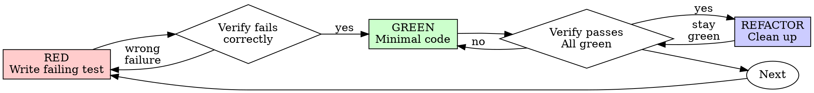

# Test-Driven Development (TDD)

## Overview

Write the test first. Watch it fail. Write minimal code to pass.

**Core principle:** If you didn't watch the test fail, you don't know if it tests the right thing.

**Violating the letter of the rules is violating the spirit of the rules.**

## When to Use

**Always:**

- New features
- Bug fixes
- Refactoring
- Behavior changes

**Exceptions (ask your human partner):**

- Throwaway prototypes
- Generated code
- Configuration files

Thinking "skip TDD just this once"? Stop. That's rationalization.

## The Iron Law

```
NO PRODUCTION CODE WITHOUT A FAILING TEST FIRST
```

Write code before the test? Delete it. Start over.

**No exceptions:**

- Don't keep it as "reference"
- Don't "adapt" it while writing tests
- Don't look at it
- Delete means delete

Implement fresh from tests. Period.

## Red-Green-Refactor



### RED - Write Failing Test

Write one minimal test showing what should happen.

<Good>

```typescript
test("retries failed operations 3 times", async () => {
  let attempts = 0;
  const operation = () => {
    attempts++;
    if (attempts < 3) throw new Error("fail");
    return "success";
  };

  const result = await retryOperation(operation);

  expect(result).toBe("success");
  expect(attempts).toBe(3);
});
```

Clear name, tests real behavior, one thing

</Good>

<Bad>

```typescript
test("retry works", async () => {
  const mock = jest
    .fn()
    .mockRejectedValueOnce(new Error())
    .mockRejectedValueOnce(new Error())
    .mockResolvedValueOnce("success");
  await retryOperation(mock);
  expect(mock).toHaveBeenCalledTimes(3);
});
```

Vague name, tests mock not code

</Bad>

**Requirements:**

- One behavior
- Clear name
- Real code (no mocks unless unavoidable)

### Verify RED - Watch It Fail

**MANDATORY. Never skip.**

```bash
npm test path/to/test.test.ts
```

Confirm:

- Test fails (not errors)
- Failure message is expected
- Fails because feature missing (not typos)

**Test passes?** You're testing existing behavior. Fix test.

**Test errors?** Fix error, re-run until it fails correctly.

### GREEN - Minimal Code

Write simplest code to pass the test.

<Good>

```typescript
async function retryOperation<T>(fn: () => Promise<T>): Promise<T> {
  for (let i = 0; i < 3; i++) {
    try {
      return await fn();
    } catch (e) {
      if (i === 2) throw e;
    }
  }
  throw new Error("unreachable");
}
```

Just enough to pass

</Good>

<Bad>

```typescript
async function retryOperation<T>(
  fn: () => Promise<T>,
  options?: {
    maxRetries?: number;
    backoff?: "linear" | "exponential";
    onRetry?: (attempt: number) => void;
  },
): Promise<T> {
  // YAGNI
}
```

Over-engineered

</Bad>

Don't add features, refactor other code, or "improve" beyond the test.

### Verify GREEN - Watch It Pass

**MANDATORY.**

```bash
npm test path/to/test.test.ts
```

Confirm:

- Test passes
- Other tests still pass
- Output pristine (no errors, warnings)

**Test fails?** Fix code, not test.

**Other tests fail?** Fix now.

### REFACTOR - Clean Up

After green only:

- Remove duplication
- Improve names
- Extract helpers

Keep tests green. Don't add behavior.

### Repeat

Next failing test for next feature.

## What a Good Failing Test Proves

Watching a test fail isn't a ritual checkbox — it's evidence, and evidence has a specific shape.
A RED that lacks this shape proves nothing, even though you technically "ran the test and it
failed." Before treating a RED as your baseline, confirm all four:

1. **It fails at the assertion, not before it.** An import error, a typo'd method name, or a
   crashed setup block isn't a RED — it's a broken test. If the failure is a
   type/reference/collection error rather than an assertion mismatch, fix the test first and
   re-run before trusting it.
2. **The failure message names the actual gap.** `expected 'Email required', got undefined` tells
   you what's missing. A bare assertion failure with no values doesn't — you can't tell if it
   failed for the reason you think it did.
3. **It would pass for the change you're about to make, and not for an unrelated stub.** If a
   trivial fake (`return true`, an empty object) would also make it pass, the assertion isn't
   pinned to the behavior yet — tighten it before writing GREEN code against it.
4. **It's reproducible on a clean re-run.** Run it once more before touching implementation code.
   A RED that flips to GREEN with no code change was never testing what you thought (shared
   state, ordering, a flaky fixture) — fix that before trusting the cycle.

Can't say yes to all four? You don't have a RED yet — you have a red screen.

## Good Tests

| Quality          | Good                                | Bad                                                 |
| ---------------- | ----------------------------------- | --------------------------------------------------- |
| **Minimal**      | One thing. "and" in name? Split it. | `test('validates email and domain and whitespace')` |
| **Clear**        | Name describes behavior             | `test('test1')`                                     |
| **Shows intent** | Demonstrates desired API            | Obscures what code should do                        |

## Why Order Matters

**"I'll write tests after to verify it works"**

Tests written after code pass immediately. Passing immediately proves nothing:

- Might test wrong thing
- Might test implementation, not behavior
- Might miss edge cases you forgot
- You never saw it catch the bug

Test-first forces you to see the test fail, proving it actually tests something.

**"I already manually tested all the edge cases"**

Manual testing is ad-hoc. You think you tested everything but:

- No record of what you tested
- Can't re-run when code changes
- Easy to forget cases under pressure
- "It worked when I tried it" ≠ comprehensive

Automated tests are systematic. They run the same way every time.

**"Deleting X hours of work is wasteful"**

Sunk cost fallacy. The time is already gone. Your choice now:

- Delete and rewrite with TDD (X more hours, high confidence)
- Keep it and add tests after (30 min, low confidence, likely bugs)

The "waste" is keeping code you can't trust. Working code without real tests is technical debt.

**"TDD is dogmatic, being pragmatic means adapting"**

TDD IS pragmatic:

- Finds bugs before commit (faster than debugging after)
- Prevents regressions (tests catch breaks immediately)
- Documents behavior (tests show how to use code)
- Enables refactoring (change freely, tests catch breaks)

"Pragmatic" shortcuts = debugging in production = slower.

**"Tests after achieve the same goals - it's spirit not ritual"**

No. Tests-after answer "What does this do?" Tests-first answer "What should this do?"

Tests-after are biased by your implementation. You test what you built, not what's required. You verify remembered edge cases, not discovered ones.

Tests-first force edge case discovery before implementing. Tests-after verify you remembered everything (you didn't).

30 minutes of tests after ≠ TDD. You get coverage, lose proof tests work.

## Common Rationalizations

| Excuse                                 | Reality                                                                 |
| -------------------------------------- | ----------------------------------------------------------------------- |
| "Too simple to test"                   | Simple code breaks. Test takes 30 seconds.                              |
| "I'll test after"                      | Tests passing immediately prove nothing.                                |
| "Tests after achieve same goals"       | Tests-after = "what does this do?" Tests-first = "what should this do?" |
| "Already manually tested"              | Ad-hoc ≠ systematic. No record, can't re-run.                           |
| "Deleting X hours is wasteful"         | Sunk cost fallacy. Keeping unverified code is technical debt.           |
| "Keep as reference, write tests first" | You'll adapt it. That's testing after. Delete means delete.             |
| "Need to explore first"                | Fine. Throw away exploration, start with TDD.                           |
| "Test hard = design unclear"           | Listen to test. Hard to test = hard to use.                             |
| "TDD will slow me down"                | TDD faster than debugging. Pragmatic = test-first.                      |
| "Manual test faster"                   | Manual doesn't prove edge cases. You'll re-test every change.           |
| "Existing code has no tests"           | You're improving it. Add tests for existing code.                       |

## Red Flags - STOP and Start Over

- Code before test
- Test after implementation
- Test passes immediately
- Can't explain why test failed
- Tests added "later"
- Rationalizing "just this once"
- "I already manually tested it"
- "Tests after achieve the same purpose"
- "It's about spirit not ritual"
- "Keep as reference" or "adapt existing code"
- "Already spent X hours, deleting is wasteful"
- "TDD is dogmatic, I'm being pragmatic"
- "This is different because..."

**All of these mean: Delete code. Start over with TDD.**

## Example: Bug Fix

**Bug:** Empty email accepted

**RED**

```typescript
test("rejects empty email", async () => {
  const result = await submitForm({ email: "" });
  expect(result.error).toBe("Email required");
});
```

**Verify RED**

```bash
$ npm test
FAIL: expected 'Email required', got undefined
```

**GREEN**

```typescript
function submitForm(data: FormData) {
  if (!data.email?.trim()) {
    return { error: "Email required" };
  }
  // ...
}
```

**Verify GREEN**

```bash
$ npm test
PASS
```

**REFACTOR**
Extract validation for multiple fields if needed.

## Verification Checklist

Before marking work complete:

- [ ] Every new function/method has a test
- [ ] Watched each test fail before implementing
- [ ] Each test failed for expected reason (feature missing, not typo)
- [ ] Wrote minimal code to pass each test
- [ ] All tests pass
- [ ] Output pristine (no errors, warnings)
- [ ] Tests use real code (mocks only if unavoidable)
- [ ] Edge cases and errors covered

Can't check all boxes? You skipped TDD. Start over.

## In keystone's Crew Workflow

When TDD runs inside a dispatched implementation task (the `subagent-driven-development` skill's
Mason → Quinn → Riley chain), the cycle isn't just personal discipline — it's the evidence the
next crew member acts on.

- **RED is what you report, not just what you did.** A status report's evidence should carry the
  actual failing-then-passing output for load-bearing tests — the same evidence
  `verification-before-completion` requires before any completion claim. "I followed TDD" with no
  transcript is a claim, not proof.
- **Name what was actually watched fail.** When a completed task's summary gets carried forward
  (a run-state entry, a one-line stub, a handoff note), the one durable fact worth keeping is
  concrete — "3 new tests, each red-green verified" — not a restatement of the diff.
- **GREEN proves rung 4 only for the tested path.** `verification-before-completion`'s
  existence → substantive → wired → functional ladder still applies on top of a green suite: a
  passing unit test proves the function works when called directly, not that the real caller
  reaches it. Grep for the caller before reporting the feature done.
- **The QA gate re-checks this — it doesn't take your word for it.** The test-quality audit
  (circular tests, weak assertions, disabled tests, expected-value provenance) is exactly the set
  of ways a "green" TDD cycle can still be theater. Write toward passing that audit, not just
  toward green.

## When Stuck

| Problem                | Solution                                                             |
| ---------------------- | -------------------------------------------------------------------- |
| Don't know how to test | Write wished-for API. Write assertion first. Ask your human partner. |
| Test too complicated   | Design too complicated. Simplify interface.                          |
| Must mock everything   | Code too coupled. Use dependency injection.                          |
| Test setup huge        | Extract helpers. Still complex? Simplify design.                     |

## Debugging Integration

Bug found? Write failing test reproducing it. Follow TDD cycle. Test proves fix and prevents regression.

Never fix bugs without a test.

## TDD for LLM and Agent Code

Code that calls a model is two layers, and they take TDD differently:

- **The deterministic shell** — parsing, retries, routing, schema validation, tool-call
  dispatch, budget tracking, prompt assembly. This is ordinary code. TDD it exactly as above:
  real input, one behavior, watch it fail, minimal code, watch it pass. Stub the model call at
  this layer's boundary (see `testing-anti-patterns.md` — mock at the boundary you don't own,
  not the logic you do).
- **The model call itself** — the thing that can return a different string on every run. You
  cannot TDD toward one exact output; write the test for what a _correct_ output must satisfy
  instead.

For the model-call layer, RED/GREEN still applies — the assertion just changes shape:

- Assert **structure, not string equality**: valid against the output schema, required fields
  present, no forbidden tool/field appears, output within a length/cost/latency budget.
- Assert **a property over a golden set** ("for this input class, the output always contains
  X"), run against a small, versioned set of real inputs — not one hand-typed example.
- Treat **flakiness as data, not noise**. A property that passes 8 of 10 seeded runs isn't
  proven — either tighten the prompt/contract until it's ~10/10, or make the tolerance explicit
  in the test (`passes >= 9 of 10 seeds`) instead of quietly re-running until green.
- **Watch a real RED first, same as any other test.** Run the golden set against the current
  prompt/behavior before changing it, confirm the property genuinely fails (not an eval-harness
  bug), then change it, then re-run. A prompt tweak with no failing-then-passing eval run is
  exactly the tested-after trap this skill exists to prevent — you just can't see it happen.
- **Keep the fast suite fast.** Unit-test the deterministic shell against a stubbed model
  response on every run; reserve the slower, real-model golden-set eval for changes that
  actually touch prompt/behavior. State which tier a change was verified against — stubbed
  shell tests aren't evidence for a prompt-behavior claim.

This doesn't relax the Iron Law — it says what "the test" and "watch it fail" mean when the
thing under test doesn't return the same value twice. None of this depends on a specific model
provider, eval framework, or harness; substitute your stack's equivalents.

## Testing Anti-Patterns

When adding mocks or test utilities, read [testing-anti-patterns.md](testing-anti-patterns.md) to avoid common pitfalls:

- Testing mock behavior instead of real behavior
- Adding test-only methods to production classes
- Mocking without understanding dependencies

## Final Rule

```
Production code → test exists and failed first
Otherwise → not TDD
```

No exceptions without your human partner's permission.
