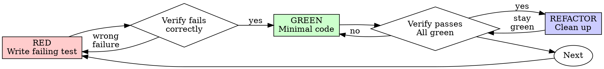

# Test-Driven Development (TDD)

## Overview

Write the test first. Watch it fail. Write the minimal code that passes.

**The whole point is the failure you observe.** A test you never saw fail proves only that it
passes now — not that it would catch the bug it was written for. Test-after produces suites
that are green from birth and blind by construction.

## When it applies

The default for new features, bug fixes, and behavior changes. Bug fixes especially — the
failing test *is* the reproduction, and it's the only thing that proves the fix fixed anything.

Reasonable to skip for throwaway prototypes, generated code, and pure configuration. If you're
skipping for a different reason, say so out loud rather than quietly — "I'm writing this
untested because X" is a fine thing to say and a bad thing to leave implicit.

## Test-first, and what to do when you slip

Write the test before the production code. When you've already written the code — which happens
— don't try to reverse-engineer a test around it. Set the implementation aside, write the test
from the requirement, watch it fail, then implement against it.

Writing the test while looking at the implementation is how you end up asserting what the code
does instead of what it should do. That's the failure mode this rule exists to prevent, and
it's why "adapt it while writing tests" doesn't work.

## Red-Green-Refactor



### Before RED - Find the Real Test Command

You can't watch a test fail with a command that doesn't run. Before the first test:

- **Find the build system** from the root manifest, and prefer a checked-in wrapper
  (`./gradlew`, `./mvnw`, `make test`, a repo script) over a globally installed tool — the
  wrapper pins the version the project actually builds with.
- **Learn both commands**: the focused single-test run (your tight loop) and the full-suite
  run (the pre-commit gate). They're rarely the same invocation.
- **Read the CI workflow** — it names the commands that actually gate merges, including the
  lint/typecheck steps a green local suite won't mention.

Don't assume a default. The `npm test` lines below are illustrative — substitute what you found.

### Before RED - Agree the Seam

A **seam** is where an interface lives — the place behaviour can be altered without editing in
place, and therefore the place a test can observe it from without reaching inside.
(`improve-codebase-architecture` owns this term for the kit.) Which seam a test belongs at is the
other thing settled before RED, not discovered while writing the assertion.

Naming it up front is what bounds the effort. Left unnamed, tests land at whatever boundary was
easiest to reach — and you get the red flag at the end of this file: the same behavior asserted at
three levels, and nothing at the one that would have caught the regression.

**An unconfirmed seam is a question, not a default.** If you can't name the seam this test
belongs at, stop and ask — propose the seams you'd test at and get them confirmed. When there's
no one to confirm with (an autonomous run), the fallback is to write down the seam you chose and
why, where a reviewer will see it — not to pick by convenience and leave the choice implicit.

If *no* correct seam exists — nothing observable sits at the level the behavior actually lives
at — that's a finding about the architecture, not a gap in your effort. Report it and route to
`improve-codebase-architecture` rather than pinning a shallow test that goes green without
proving anything. `systematic-debugging` Phase 4 applies the same rule to regression tests; this
is that rule at feature-writing time.

### RED - Write Failing Test

Write one minimal test showing what should happen.

<Good>

```typescript
test("retries failed operations 3 times", async () => {
  let attempts = 0;
  const operation = () => {
    attempts++;
    if (attempts < 3) throw new Error("fail");
    return "success";
  };

  const result = await retryOperation(operation);

  expect(result).toBe("success");
  expect(attempts).toBe(3);
});
```

Clear name, tests real behavior, one thing

</Good>

<Bad>

```typescript
test("retry works", async () => {
  const mock = jest
    .fn()
    .mockRejectedValueOnce(new Error())
    .mockRejectedValueOnce(new Error())
    .mockResolvedValueOnce("success");
  await retryOperation(mock);
  expect(mock).toHaveBeenCalledTimes(3);
});
```

Vague name, tests mock not code

</Bad>

**Requirements:**

- One behavior
- Clear name
- Real code (no mocks unless unavoidable)

### Verify RED - Watch It Fail

This is the step that makes the rest worth doing — skip it and you're writing tests, not doing
TDD. Run it:

```bash
npm test path/to/test.test.ts
```

Confirm all three:

- It **fails** rather than errors
- The failure message is the one you expected
- It fails because the feature is missing — not from a typo or an import mistake

**Test passes?** You're testing existing behavior. Fix test.

**Test errors?** Fix error, re-run until it fails correctly.

### GREEN - Minimal Code

Write simplest code to pass the test.

<Good>

```typescript
async function retryOperation<T>(fn: () => Promise<T>): Promise<T> {
  for (let i = 0; i < 3; i++) {
    try {
      return await fn();
    } catch (e) {
      if (i === 2) throw e;
    }
  }
  throw new Error("unreachable");
}
```

Just enough to pass

</Good>

<Bad>

```typescript
async function retryOperation<T>(
  fn: () => Promise<T>,
  options?: {
    maxRetries?: number;
    backoff?: "linear" | "exponential";
    onRetry?: (attempt: number) => void;
  },
): Promise<T> {
  // YAGNI
}
```

Over-engineered

</Bad>

Don't add features, refactor other code, or "improve" beyond the test.

### Verify GREEN - Watch It Pass

```bash
npm test path/to/test.test.ts
```

Confirm:

- Test passes
- Other tests still pass
- Output pristine (no errors, warnings)

**Test fails?** Fix code, not test.

**Other tests fail?** Fix now.

### REFACTOR - Clean Up

After green only:

- Remove duplication
- Improve names
- Extract helpers

Keep tests green. Don't add behavior.

### Repeat

Next failing test for next feature.

## What a Good Failing Test Proves

Watching a test fail isn't a ritual checkbox — it's evidence, and evidence has a specific shape.
A RED that lacks this shape proves nothing, even though you technically "ran the test and it
failed." Before treating a RED as your baseline, confirm all four:

1. **It fails at the assertion, not before it.** An import error, a typo'd method name, or a
   crashed setup block isn't a RED — it's a broken test. If the failure is a
   type/reference/collection error rather than an assertion mismatch, fix the test first and
   re-run before trusting it.
2. **The failure message names the actual gap.** `expected 'Email required', got undefined` tells
   you what's missing. A bare assertion failure with no values doesn't — you can't tell if it
   failed for the reason you think it did.
3. **It would pass for the change you're about to make, and not for an unrelated stub.** If a
   trivial fake (`return true`, an empty object) would also make it pass, the assertion isn't
   pinned to the behavior yet — tighten it before writing GREEN code against it.
4. **It's reproducible on a clean re-run.** Run it once more before touching implementation code.
   A RED that flips to GREEN with no code change was never testing what you thought (shared
   state, ordering, a flaky fixture) — fix that before trusting the cycle.

Can't say yes to all four? You don't have a RED yet — you have a red screen.

## Good Tests

| Quality          | Good                                | Bad                                                 |
| ---------------- | ----------------------------------- | --------------------------------------------------- |
| **Minimal**      | One thing. "and" in name? Split it. | `test('validates email and domain and whitespace')` |
| **Clear**        | Name describes behavior             | `test('test1')`                                     |
| **Shows intent** | Demonstrates desired API            | Obscures what code should do                        |

## Why the order matters

Tests written after the code pass on the first run. That tells you nothing — you never saw the
test catch anything, so you don't know it can. It might be asserting the wrong thing, testing
the implementation rather than the behavior, or quietly missing the case you forgot.

The deeper issue is bias. Tests-after answer *"what does this do?"* — you write assertions by
reading your own implementation, so the test inherits every misunderstanding baked into the
code. Tests-first answer *"what should this do?"*, which is the question the requirement
actually asked. This is why writing a test while looking at the implementation doesn't recover
the benefit, and why exploration code is better thrown away than retrofitted.

Manual verification has the same gap plus one more: no record, and no way to re-run it when the
code changes next month.

Two related signals worth listening to:

- **A test that's hard to write is telling you the design is hard to use.** Fix the design, not
  the test.
- **Already sunk hours into untested code?** That time is spent either way. The only question
  is whether you now want code you can change safely.

## Example: Bug Fix

**Bug:** Empty email accepted

**RED**

```typescript
test("rejects empty email", async () => {
  const result = await submitForm({ email: "" });
  expect(result.error).toBe("Email required");
});
```

**Verify RED**

```bash
$ npm test
FAIL: expected 'Email required', got undefined
```

**GREEN**

```typescript
function submitForm(data: FormData) {
  if (!data.email?.trim()) {
    return { error: "Email required" };
  }
  // ...
}
```

**Verify GREEN**

```bash
$ npm test
PASS
```

**REFACTOR**
Extract validation for multiple fields if needed.

## Verification Checklist

Before marking work complete:

- [ ] Every new function/method has a test
- [ ] Watched each test fail before implementing
- [ ] Each test failed for expected reason (feature missing, not typo)
- [ ] Wrote minimal code to pass each test
- [ ] All tests pass
- [ ] Output pristine (no errors, warnings)
- [ ] Tests use real code (mocks only if unavoidable)
- [ ] Edge cases and errors covered

Can't check all boxes? You skipped TDD. Start over.

## In keystone's Crew Workflow

When TDD runs inside a dispatched implementation task (the `subagent-driven-development` skill's
Mason → Quinn → Riley chain), the cycle isn't just personal discipline — it's the evidence the
next crew member acts on.

- **RED is what you report, not just what you did.** A status report's evidence should carry the
  actual failing-then-passing output for load-bearing tests — the same evidence
  `verification-before-completion` requires before any completion claim. "I followed TDD" with no
  transcript is a claim, not proof.
- **Name what was actually watched fail.** When a completed task's summary gets carried forward
  (a run-state entry, a one-line stub, a handoff note), the one durable fact worth keeping is
  concrete — "3 new tests, each red-green verified" — not a restatement of the diff.
- **GREEN proves rung 4 only for the tested path.** `verification-before-completion`'s
  existence → substantive → wired → functional ladder still applies on top of a green suite: a
  passing unit test proves the function works when called directly, not that the real caller
  reaches it. Grep for the caller before reporting the feature done.
- **The QA gate re-checks this — it doesn't take your word for it.** The test-quality audit
  (circular tests, weak assertions, disabled tests, expected-value provenance) is exactly the set
  of ways a "green" TDD cycle can still be theater. Write toward passing that audit, not just
  toward green.

## When Stuck

| Problem                | Solution                                                             |
| ---------------------- | -------------------------------------------------------------------- |
| Don't know how to test | Write the API you wish existed, then the assertion. Ask if still stuck. |
| Test too complicated   | Design too complicated. Simplify interface.                          |
| Must mock everything   | Code too coupled. Use dependency injection.                          |
| Test setup huge        | Extract helpers. Still complex? Simplify design.                     |

## Debugging Integration

Bug found? Write failing test reproducing it. Follow TDD cycle. Test proves fix and prevents regression.

Never fix bugs without a test.

## TDD for LLM and Agent Code

Code that calls a model is two layers, and they take TDD differently:

- **The deterministic shell** — parsing, retries, routing, schema validation, tool-call
  dispatch, budget tracking, prompt assembly. This is ordinary code. TDD it exactly as above:
  real input, one behavior, watch it fail, minimal code, watch it pass. Stub the model call at
  this layer's boundary (see `testing-anti-patterns.md` — mock at the boundary you don't own,
  not the logic you do).
- **The model call itself** — the thing that can return a different string on every run. You
  cannot TDD toward one exact output; write the test for what a _correct_ output must satisfy
  instead.

For the model-call layer, RED/GREEN still applies — the assertion just changes shape:

- Assert **structure, not string equality**: valid against the output schema, required fields
  present, no forbidden tool/field appears, output within a length/cost/latency budget.
- Assert **a property over a golden set** ("for this input class, the output always contains
  X"), run against a small, versioned set of real inputs — not one hand-typed example.
- Treat **flakiness as data, not noise**. A property that passes 8 of 10 seeded runs isn't
  proven — either tighten the prompt/contract until it's ~10/10, or make the tolerance explicit
  in the test (`passes >= 9 of 10 seeds`) instead of quietly re-running until green.
- **Watch a real RED first, same as any other test.** Run the golden set against the current
  prompt/behavior before changing it, confirm the property genuinely fails (not an eval-harness
  bug), then change it, then re-run. A prompt tweak with no failing-then-passing eval run is
  exactly the tested-after trap this skill exists to prevent — you just can't see it happen.
- **Keep the fast suite fast.** Unit-test the deterministic shell against a stubbed model
  response on every run; reserve the slower, real-model golden-set eval for changes that
  actually touch prompt/behavior. State which tier a change was verified against — stubbed
  shell tests aren't evidence for a prompt-behavior claim.

This doesn't loosen the discipline — it translates "the test" and "watch it fail" for a
subject that doesn't return the same value twice. None of this depends on a specific model
provider, eval framework, or harness; substitute your stack's equivalents.

## Testing Anti-Patterns

When adding mocks or test utilities, read [testing-anti-patterns.md](testing-anti-patterns.md) to avoid common pitfalls:

- Testing mock behavior instead of real behavior
- Adding test-only methods to production classes
- Mocking without understanding dependencies

## Rationalizations

| Rationalization | Reality |
| --- | --- |
| "I already know what it should do — I'll write the test after" | The test costs the same either way. Written after, it inherits the implementation's assumptions instead of checking them; knowing the answer is an argument for writing it down first, not for skipping it. |
| "It obviously fails, no need to actually run RED" | A typo'd import "obviously fails" too, and looks identical from here. The run takes seconds and is the only evidence the test can fail at all. |
| "It passed on the first run — good, the code already works" | Or the assertion is pinned to nothing. A test that has never failed has never demonstrated it can. Break the implementation on purpose and confirm the test notices. |
| "This is too simple to test" | Simple code is cheap to test, which is an argument for the test rather than against it. The cases that ship broken are rarely the complicated ones. |
| "The assertion was too strict, so I loosened it" | You edited the specification to match the output. If the looser assertion is genuinely right, say what was wrong with the requirement; otherwise it's the code that's failing. |
| "It's a one-line fix — the test is more work than the bug" | The failing test *is* the reproduction. Without it there's no evidence the bug existed, and nothing to catch it coming back. |
| "I'll add tests once the design settles" | Design settles by being used, and the test is the first use. Tests deferred to the end get written against whatever happened to ship. |
| "Model output changes every run — you can't test it" | You can't assert one exact string. You can assert the properties a correct output must satisfy, over a versioned set of inputs. "Untestable" usually means the assertion hasn't been chosen yet. |
| "I'll just test it at whatever level is easiest to reach" | Ease of access is a fact about the code's shape, not evidence the behavior lives there. Convenience picks a level; it doesn't pick the level that would catch the bug. Name the seam, then write the test it implies. |

## Red flags

Process signals. The test-*quality* ones — mock-shaped assertions, test-only production
methods — live in [testing-anti-patterns.md](testing-anti-patterns.md).

- Implementation and its first test arriving in one commit, with no record of the test failing
- Every test in a new suite green on its first run
- An assertion weakened, narrowed, or skipped in the same change that turned the suite green
- An expected value copied from the current output rather than derived from the requirement
- A bug fix merged with no test that fails against the code as it was before the fix
- "Followed TDD" in a status report with no failing-then-passing output attached
- A test still passing with the feature under test commented out, and nobody having checked
- A prompt or model-behavior change landed with no eval run that was red before it
- The same behavior asserted at unit, integration, and end-to-end level, with no seam ever agreed

## The short version

Production code should have a test that existed first and failed first. When it doesn't, that's
a deliberate call worth stating out loud rather than a detail to leave unmentioned.
