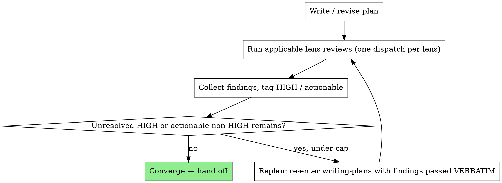

# Plan Convergence Loop

**Optional.** For a large or high-stakes plan, after the one-shot Self-Review in `SKILL.md`, run
the plan through a bounded review→replan loop until no HIGH concern remains. Skip it for small or
mechanical plans — rigor scales to risk, and a single fresh-eyes pass is enough for those.

## The lenses (diversity without external tools)

Diversity here comes from **different lenses on the same model**, not from different model
binaries — nothing external is required. (Where the dispatch primitive takes a per-dispatch model
override, you can additionally run one lens a tier above the session model for extra
decorrelation — optional icing, never a prerequisite.) Each lens is a variant of
`./plan-document-reviewer-prompt.md` dispatched as its own reviewer pass over the **same** plan:

- **Goal lens** (Riley / `code-reviewer`) — does the plan cover every spec requirement? Any
  silent scope drop ("v1 just does X", "wire up later")?
- **Buildability lens** (Riley / `code-reviewer`) — could a zero-context engineer execute each
  task without getting stuck? Placeholders, missing paths/commands, type/signature drift across
  tasks?
- **Security lens** (Sage / `security-reviewer`) — **only when a sensitive surface is in scope**
  (auth, secrets, money, deletion, irreversible, external input, LLM trust); otherwise skipped.

Each lens tags every finding `HIGH` or `non-HIGH (actionable)`, and the base prompt's blocking
Risk + Discovery Gate still applies to every lens — a gate failure is always HIGH.

## The loop

"Actionable" = a finding the planner can actually fix in the plan, not a wish.

## Stop condition

Converge when **no unresolved HIGH concern and no actionable non-HIGH finding remain**, or when
the cycle cap is hit. Default cap **~3** replan→re-review cycles.

## Stall detection & escalation

Track the **unresolved-HIGH count** across rounds. If it is not _decreasing_ (same count, or new
HIGHs replacing fixed ones each pass), the loop is stuck — **stop and escalate to the human**,
don't spin. A reviewer surfacing fresh HIGHs every pass signals the spec or plan is wrong, not
that one more round will converge. This is the same discipline as Review Loop Control in
`subagent-driven-development` — pass findings **word-for-word**, cap the loop, watch the count.

## Where it plugs in

Run **after** Self-Review (`SKILL.md`). Triggered manually, or via `/spec --review-convergence`.
It holds nothing on disk — round counts and findings live in the orchestrator's context, not a
state file.
